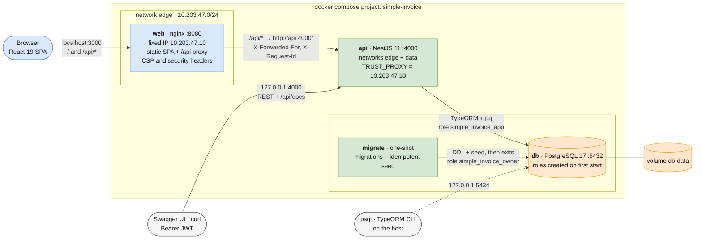
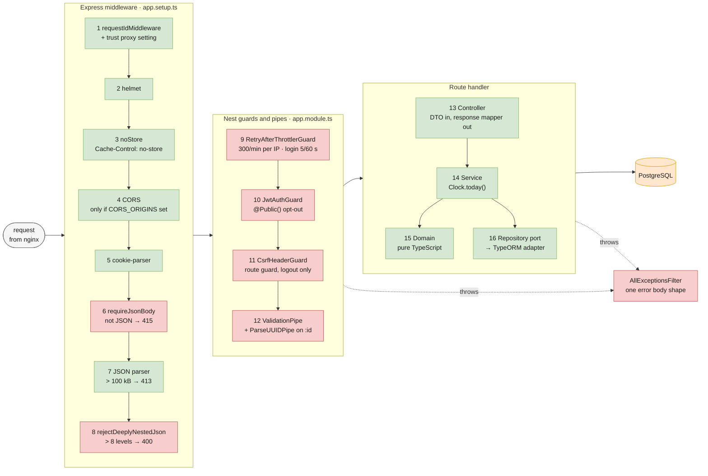
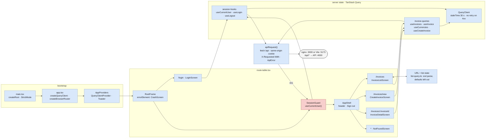
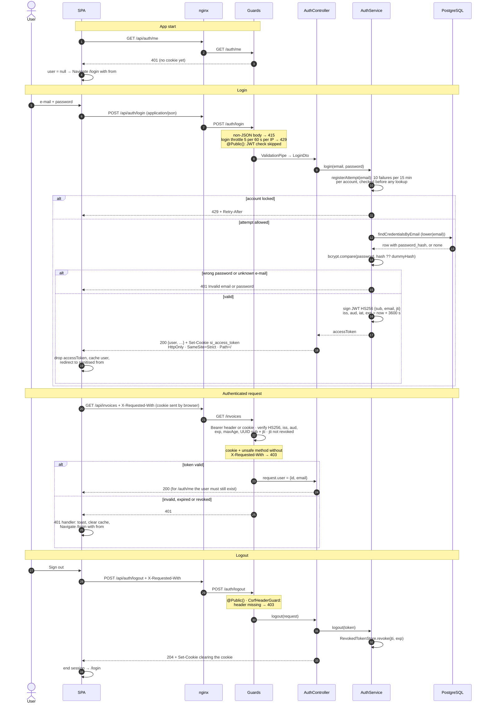
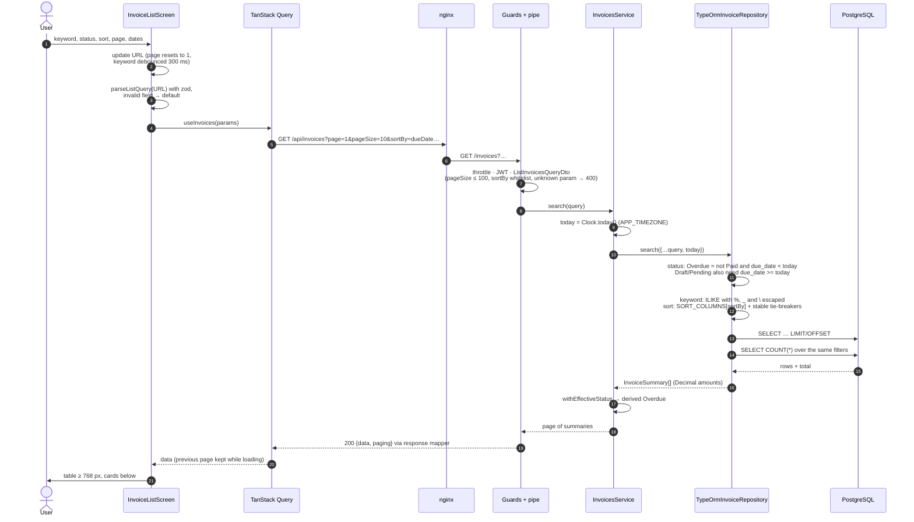
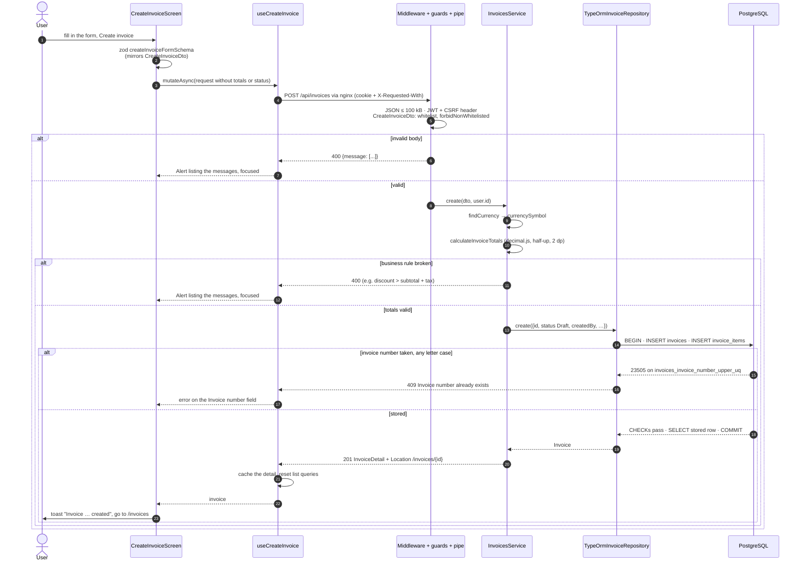
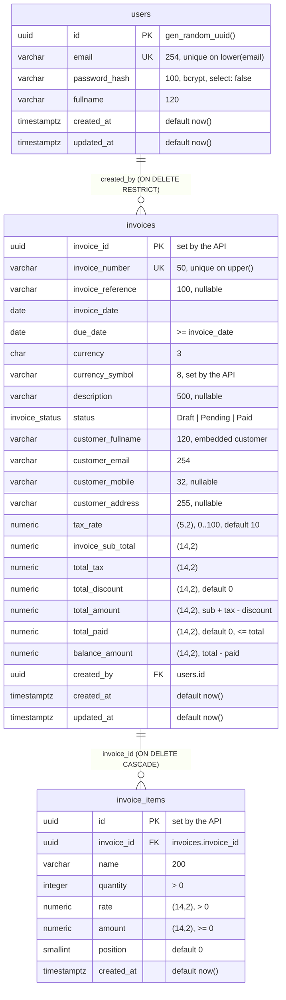

# SimpleInvoice

SimpleInvoice is the 101 Digital full-stack assessment: a **React 19 + TypeScript** single-page app, a
**NestJS 11** REST API and a **PostgreSQL 17** database, started together with one command through Docker Compose.

You sign in, then search, filter, sort and page through invoices, open one, or create a new one. The server
always computes invoice totals and the _Overdue_ status.

|                       |                                                                                                                                                                                |
| --------------------- | ------------------------------------------------------------------------------------------------------------------------------------------------------------------------------ |
| **Start everything**  | `make up`, then open <http://localhost:3000>                                                                                                                                   |
| **Sign in**           | `reviewer@simpleinvoice.dev` / `Reviewer@2026`                                                                                                                                 |
| **API documentation** | Swagger UI at <http://localhost:4000/api/docs>                                                                                                                                 |
| **Deeper reading**    | [Architecture diagrams](#2-architecture) · [API contract](docs/API_CONTRACT.md) · [Security](docs/SECURITY.md) · [API app](apps/api/README.md) · [Web app](apps/web/README.md) |

## Contents

1. [Features against the brief](#1-features-against-the-brief)
2. [Architecture](#2-architecture)
   - [2.1 System architecture](#21-system-architecture)
   - [2.2 Backend layers and request pipeline](#22-backend-layers-and-request-pipeline)
   - [2.3 Frontend structure](#23-frontend-structure)
   - [2.4 Auth flow](#24-auth-flow)
   - [2.5 Invoice list flow](#25-invoice-list-flow)
   - [2.6 Create invoice flow](#26-create-invoice-flow)
   - [2.7 Database ERD](#27-database-erd)
   - [2.8 Security layers](#28-security-layers)
3. [Tech stack](#3-tech-stack)
4. [Repository layout (monorepo)](#4-repository-layout-monorepo)
5. [Quick start with Docker](#5-quick-start-with-docker)
6. [Running without Docker](#6-running-without-docker)
7. [Seed data](#7-seed-data)
8. [Configuration](#8-configuration)
9. [API overview](#9-api-overview)
10. [Testing](#10-testing)
11. [Continuous integration](#11-continuous-integration)
12. [Security](#12-security)
13. [Design decisions and assumptions](#13-design-decisions-and-assumptions)
14. [Known limitations](#14-known-limitations)
15. [Troubleshooting](#15-troubleshooting)

---

## 1. Features against the brief

| Brief        | Requirement                                                                                             | How it is met                                                                                                                                 |
| ------------ | ------------------------------------------------------------------------------------------------------- | --------------------------------------------------------------------------------------------------------------------------------------------- |
| 2.1.1        | Login with e-mail + password, client- and server-side validation                                        | zod schema in the form (`apps/web/src/session/login-form.ts`) and `LoginDto` with class-validator                                             |
| 2.1.1        | Issue a JWT and store it securely on the client                                                         | HS256 JWT set as an **HttpOnly, SameSite=Strict** cookie that no script can read. The body also returns it for Bearer clients (Swagger, curl) |
| 2.1.1        | Protected routes redirect to the login screen                                                           | `SessionGuard` layout route on the web, global `JwtAuthGuard` on the API. The user returns to the original page after signing in              |
| 2.1.2        | Invoice list is the home screen                                                                         | `/` redirects to `/invoices`                                                                                                                  |
| 2.1.2        | Number, customer, invoice date, due date, total, status                                                 | table from 768 px, cards on phones                                                                                                            |
| 2.1.2        | Search by number or customer name (case-insensitive, partial)                                           | `ILIKE '%…%'` with escaped wildcards, backed by `pg_trgm` GIN indexes                                                                         |
| 2.1.2        | Filter by Draft / Pending / Paid / Overdue                                                              | SQL filter that uses the same rule as the derived _Overdue_ status                                                                            |
| 2.1.2        | Sort by invoice date, due date, total (ASC/DESC)                                                        | whitelisted sort columns plus stable tie-breakers                                                                                             |
| 2.1.2        | Server-side pagination with configurable page size                                                      | `page`, `pageSize` (API 1–100; the UI offers 10 / 20 / 50)                                                                                    |
| 2.1.3        | Detail: invoice, customer, items, subtotal, tax, discount, total, outstanding balance, status           | `InvoiceDetailScreen` shows the stored values exactly as the API returns them                                                                 |
| 2.1.4        | Create form with the validation table, exactly one line item, status Draft, unique user-provided number | `CreateInvoiceDto` on the API, a mirrored zod schema in the form                                                                              |
| 2.1.4        | Success notification and redirect to the list                                                           | toast, then navigate to `/invoices`                                                                                                           |
| 2.1.4, 2.3.2 | Totals calculated by the backend                                                                        | `calculateInvoiceTotals` (decimal.js). The client never sends totals, and the API rejects them if it tries                                    |
| 2.2          | React + TypeScript, responsive, unit tests                                                              | Vitest + Testing Library + MSW; layouts checked at 375 px and 1440 px                                                                         |
| 2.3.1        | `POST /auth/login`, `GET /auth/me`, `GET/POST /invoices`, `GET /invoices/:id`                           | all present, plus `POST /auth/logout`, `GET /currencies` and `GET /health`                                                                    |
| 2.3.2        | Unique invoice numbers at DB level, due date ≥ invoice date, Overdue derived at read time               | unique index on `upper(invoice_number)` (letter case ignored), its violation mapped to 409; DTO rule plus DB `CHECK`; `deriveInvoiceStatus`   |
| 2.3.3        | JWT guard on `/invoices`, expiry from env (default 3600 s), seeded reviewer                             | global guard, `JWT_EXPIRES_IN`, reviewer account created by the seed                                                                          |
| 2.3.4        | Seed from Appendix A plus 20–50 generated invoices via `npm run seed`                                   | Appendix A plus 40 deterministic invoices; idempotent                                                                                         |
| 2.3.5        | class-validator + ValidationPipe, structured 400                                                        | global pipe with `whitelist` + `forbidNonWhitelisted`                                                                                         |
| 2.3.6        | Global exception filter with a consistent error body                                                    | `AllExceptionsFilter`; the spec's fields plus `path`, `timestamp`, `requestId`                                                                |
| 2.3.7        | Unit tests for totals, Overdue, due-date rule, unique numbers; at least one workflow test               | Jest unit tests, Supertest e2e against real PostgreSQL, Playwright end to end ([§10](#10-testing))                                            |
| 2.3.8        | Swagger at `/api/docs` with payloads, query parameters, responses                                       | `@nestjs/swagger`, with Bearer and cookie auth schemes                                                                                        |
| 2.4.1        | Monorepo or two repos, documented                                                                       | monorepo ([§4](#4-repository-layout-monorepo))                                                                                                |
| 2.4.2        | One `docker compose` command; a Dockerfile per app; ports documented                                    | [§5](#5-quick-start-with-docker)                                                                                                              |
| 2.4.3        | `.env` configuration, `.env.example`, no hard-coded secrets                                             | `scripts/init-env.sh` generates the secrets; the API validates its environment at start-up                                                    |
| 3.2          | Document how the customer is stored                                                                     | embedded snapshot columns ([§13](#13-design-decisions-and-assumptions))                                                                       |

**Beyond the brief:**

- Hardening: the session lives in an HttpOnly cookie with a CSRF header rule and is revoked on logout, login is
  limited per client IP and per account, the API connects to PostgreSQL as a role that can only read and insert
  rows, nginx sends a strict CSP, and containers run non-root on a read-only filesystem, on two separate networks.
  The security review and its fixes are recorded in [docs/SECURITY.md](docs/SECURITY.md).
- List extras: invoice-date range filter, list state kept in the URL (shareable links, back and forward work),
  debounced search, and accessible responsive layouts.
- Traceability: every response carries an `X-Request-Id`, which also appears in API logs, error bodies and UI
  error screens.
- Database: constraints duplicate the business rules as a last line of defence, and trigram indexes serve the
  search.
- CI: GitHub Actions runs lint, format check, typecheck, unit tests, the API e2e suite against PostgreSQL, and
  Playwright (with axe accessibility checks) against the full compose stack. Dependabot keeps dependencies, the
  digest-pinned base images and the SHA-pinned actions updated.

## 2. Architecture

The browser only ever talks to **one origin**. The `web` container (nginx) serves the built SPA and reverse-proxies
`/api/*` to the `api` container with the `/api` prefix stripped. Because of that, the auth cookie is first-party
and the SPA never needs CORS, which the API leaves off by default. The API is a layered NestJS application. Each
feature module is split into `presentation → application → domain`, with `infrastructure` adapters that implement
the application's ports.

Compose puts the containers on two networks: `edge` (web, api) and `data` (migrate, api, db), so nginx cannot
even reach PostgreSQL. nginx has a fixed address on `edge` (`10.203.47.10`), the only peer whose
`X-Forwarded-For` header the API trusts. Before the API starts, a one-shot `migrate` service applies the
migrations and the seed as the schema owner, then exits. The API itself connects as a role that may only read
and insert rows. Port 3000 (`web`) is the only network-facing entry point. The API (`4000`, for Swagger and
scripts) and PostgreSQL (`5434`) are published on the host loopback interface only.

**One request, end to end** (`GET /invoices`):

1. The browser calls `GET /api/invoices?…` on its own origin. The HttpOnly cookie is attached automatically.
2. nginx forwards it to `http://api:4000/invoices?…` over a kept-alive upstream connection, adding
   `X-Forwarded-For` and `X-Request-Id`.
3. Express middleware runs: request id → helmet → `Cache-Control: no-store` → CORS (only when `CORS_ORIGINS`
   lists an origin) → cookie-parser → JSON-only check (415) → JSON body parser (100 kB, 413) → nesting depth check
   (8 levels, 400).
4. Global guards run: the throttler guard (keyed on the client IP, which the API takes from `X-Forwarded-For`
   only because the TCP peer is nginx) → `JwtAuthGuard`, which checks the JWT, including that its `jti` was not revoked
   by a logout, and, for cookie-authenticated unsafe methods, the CSRF header.
5. The global `ValidationPipe` turns the query string into a validated `ListInvoicesQueryDto`.
6. `InvoicesController` → `InvoicesService`, which takes _today_ from the injected `Clock` → `InvoiceRepository`
   port → TypeORM adapter builds parameterised SQL.
7. Rows are mapped to domain objects, the _Overdue_ status is derived, and the response is serialised as
   `{ data, paging }`. Any error goes through `AllExceptionsFilter`.

The eight diagrams below are [Mermaid](https://mermaid.js.org): GitHub, GitLab and the VS Code Markdown preview
render them in place, and they change in the same pull request as the code they describe. Colours are the same in
every diagram: **blue** is the browser and nginx, **green** the API, **orange** PostgreSQL, **red** a security
control, **grey** tooling and operations. The request and response shapes are in
[API_CONTRACT.md](docs/API_CONTRACT.md); the threat model and the review findings (the `SEC-nn` ids) are in
[SECURITY.md](docs/SECURITY.md).

### 2.1 System architecture



Start-up order is `db` healthy → `migrate` exits 0 → `api` healthy (`/health` pings the database) → `web`.
`migrate` connects as the schema owner `simple_invoice_owner`. The long-running API connects as
`simple_invoice_app` and never holds the owner or seed passwords.

### 2.2 Backend layers and request pipeline

Every request passes the same chain, from `configureApp()` in `app.setup.ts` (shared by `main.ts` and the e2e
tests) through the global guards and pipes registered in `app.module.ts`:



Each feature module (`auth`, `users`, `invoices`, `currencies`, `health`) has the same four layers. Services depend
only on ports (abstract classes used as DI tokens); Nest binds each port to an infrastructure adapter, so services
never import TypeORM, bcrypt or the JWT library:

```mermaid
flowchart TB
    subgraph presentation["presentation · controllers, DTOs, response mappers"]
        direction LR
        authCtl["AuthController<br/>/auth/login · /me · /logout"]
        invCtl["InvoicesController<br/>GET, GET :id, POST /invoices"]
        curCtl["CurrenciesController<br/>GET /currencies"]
        healthCtl["HealthController<br/>GET /health"]
    end

    subgraph application["application · use cases"]
        direction LR
        authSvc["AuthService<br/>login · logout · getProfile"]
        invSvc["InvoicesService<br/>search · getById · create"]
    end

    subgraph ports["application ports · abstract classes used as DI tokens"]
        direction LR
        pHash["PasswordHasher"]
        pIssuer["AccessTokenIssuer"]
        pLimiter["LoginAttemptLimiter"]
        pRevoked["RevokedTokenStore"]
        pUsers["UserRepository"]
        pInvoices["InvoiceRepository"]
        pClock["Clock (shared)"]
    end

    subgraph domain["domain · pure TypeScript"]
        direction LR
        userDomain["User<br/>UserCredentials"]
        invDomain["invoice-calculator<br/>deriveInvoiceStatus · Money"]
        curDomain["SUPPORTED_CURRENCIES"]
    end

    subgraph infrastructure["infrastructure · adapters, which import the ports"]
        direction LR
        aBcrypt["BcryptPasswordHasher"]
        aJwt["JwtAccessTokenIssuer"]
        aLimiter["InMemoryLoginAttemptLimiter"]
        aRevoked["InMemoryRevokedTokenStore"]
        aUsers["TypeOrmUserRepository"]
        aInvoices["TypeOrmInvoiceRepository<br/>invoice-list.query"]
        aClock["SystemClock"]
        aGuard["JwtAuthGuard · CsrfHeaderGuard<br/>AccessTokenVerifier"]
        aHealth["DatabaseHealthIndicator"]
    end

    authCtl --> authSvc
    invCtl --> invSvc
    curCtl --> curDomain
    healthCtl --> aHealth
    authSvc --> pHash & pIssuer & pLimiter & pRevoked & pUsers
    invSvc --> pInvoices & pClock
    authSvc --> userDomain
    invSvc --> invDomain & curDomain

    pHash -. "bound to" .-> aBcrypt
    pIssuer -. "bound to" .-> aJwt
    pLimiter -. "bound to" .-> aLimiter
    pRevoked -. "bound to" .-> aRevoked
    pUsers -. "bound to" .-> aUsers
    pInvoices -. "bound to" .-> aInvoices
    pClock -. "bound to" .-> aClock

    classDef be fill:#d5e8d4,stroke:#82b366,color:#1a1a1a
    classDef port fill:#ffffff,stroke:#82b366,color:#1a1a1a,stroke-dasharray:4 3
    classDef sec fill:#f8cecc,stroke:#b85450,color:#1a1a1a
    classDef data fill:#ffe6cc,stroke:#d79b00,color:#1a1a1a
    class authCtl,invCtl,curCtl,healthCtl,authSvc,invSvc,userDomain,invDomain,curDomain,aClock be
    class pHash,pIssuer,pLimiter,pRevoked,pUsers,pInvoices,pClock port
    class aBcrypt,aJwt,aLimiter,aRevoked,aGuard sec
    class aUsers,aInvoices,aHealth data
```



The in-memory login limiter and revoked-token store could be replaced by Redis-backed adapters to run several API
instances; the e2e tests replace `SystemClock` with a fixed clock.

### 2.3 Frontend structure



`SessionGuard` is a layout route: it shows a spinner while `/auth/me` is pending, sends an anonymous user to `/login`
with the current location as `from`, and registers the 401 handler that ends the session. The invoice list keeps
all its filters in the URL, so refresh, back/forward and shared links show the same view.

### 2.4 Auth flow



Login accepts JSON only, so a cross-site HTML form cannot sign a victim in. The per-account limit runs before any
lookup or bcrypt, and unknown e-mails are compared against a dummy hash, so response time does not reveal whether an
account exists. API clients (Swagger, curl) send `Authorization: Bearer <token>` instead of the cookie. There is no
refresh token: after `exp` the user signs in again.

### 2.5 Invoice list flow



One `today` feeds both the SQL filter and the displayed status, so a row never shows _Overdue_ under a _Pending_
filter. Every value is a bound parameter, the sort column comes from a whitelist map, the total is a plain
`COUNT(*)` over the same filters, and trigram GIN indexes serve `ILIKE '%keyword%'`.

### 2.6 Create invoice flow



The client never sends totals, status, `currencySymbol` or `createdBy`, and the DTO rejects them if it tries. The
unique index on `upper(invoice_number)` decides duplicates (no SELECT before INSERT, so two concurrent requests cannot
both win), and CHECK constraints refuse totals that do not add up.

### 2.7 Database ERD



In the comments, a single number is the `varchar` / `char` length and `(p,s)` is `numeric(precision, scale)`. The
names below come from the SQL migrations in
[`apps/api/src/infrastructure/database/migrations/`](apps/api/src/infrastructure/database/migrations/).

| Object                    | Definition                                                                                                                                                                                                                                                                                |
| ------------------------- | ----------------------------------------------------------------------------------------------------------------------------------------------------------------------------------------------------------------------------------------------------------------------------------------- |
| CHECKs on `invoices`      | `invoices_due_date_check` (due ≥ invoice date) · `invoices_tax_rate_check` (0–100) · `invoices_amounts_non_negative_check` · `invoices_total_paid_check` (paid ≤ total) · `invoices_balance_check` (balance = total − paid) · `invoices_total_check` (total = sub-total + tax − discount) |
| CHECKs on `invoice_items` | `quantity > 0` · `rate > 0` · `amount >= 0`                                                                                                                                                                                                                                               |
| Foreign keys              | `invoices_created_by_fk` → `users(id)` ON DELETE RESTRICT · `invoice_items.invoice_id` → `invoices(invoice_id)` ON DELETE CASCADE                                                                                                                                                         |
| Unique indexes            | `users_email_lower_uq` on `lower(email)` · `invoices_invoice_number_upper_uq` on `upper(invoice_number)` (the case-sensitive `invoices_invoice_number_uq` was dropped as redundant)                                                                                                       |
| Other indexes             | `invoices_invoice_date_idx` · `invoices_due_date_idx` · `invoices_total_amount_idx` (sort keys) · `invoices_status_due_date_idx` (status filters incl. Overdue) · `invoices_created_by_idx` · `invoice_items_invoice_id_idx`                                                              |
| Trigram GIN indexes       | `invoices_invoice_number_trgm_idx` · `invoices_customer_fullname_trgm_idx` (extension `pg_trgm`, for `ILIKE '%keyword%'`)                                                                                                                                                                 |
| Types                     | `invoice_status` ENUM (`Draft`, `Pending`, `Paid`): _Overdue_ is derived at read time and cannot be stored                                                                                                                                                                                |
| Roles                     | `simple_invoice_owner` owns the database and schema, runs migrations and the seed · `simple_invoice_app` is the API: CONNECT, USAGE, SELECT + INSERT only · neither is a superuser (`infra/postgres/initdb/01-app-roles.sh`)                                                              |

The customer is a snapshot embedded in `invoices` (no customers table), so later changes never rewrite an issued
invoice. Money is exact `numeric`, read into decimal.js values, and dates travel as `YYYY-MM-DD` strings.

### 2.8 Security layers

```mermaid
flowchart TB
    subgraph L1["1 · Browser and SPA"]
        direction LR
        b1["JWT only in an HttpOnly cookie<br/>never in JS storage"]
        b2["X-Requested-With on every call<br/>SEC-06"]
        b3["same-origin 'from' redirect"]
        b4["React escaping · encoded mailto<br/>SEC-19"]
    end
    subgraph L2["2 · Edge: nginx"]
        direction LR
        n1["CSP script-src 'self',<br/>X-Frame-Options DENY, nosniff"]
        n2["fixed IP 10.203.47.10,<br/>only trusted proxy · SEC-01"]
        n3["body ≤ 100k · proxy timeouts"]
        n4["/api/api/ → 404<br/>SEC-20"]
    end
    subgraph L3["3 · API HTTP layer"]
        direction LR
        h1["JSON only · ≤ 100 kB · depth 8<br/>SEC-04, SEC-06"]
        h2["Cache-Control: no-store<br/>SEC-07"]
        h3["no CORS by default<br/>SEC-11"]
        h4["300 req/min per IP, login 5/60 s<br/>SEC-01, SEC-15"]
    end
    subgraph L4["4 · Authentication and session"]
        direction LR
        a1["global JwtAuthGuard · HS256 pinned<br/>exp, iat, maxAge, jti · SEC-12"]
        a2["JWT_SECRET strength check<br/>SEC-14"]
        a3["bcrypt + dummy hash ·<br/>lockout 10 per 15 min · SEC-18"]
        a4["__Host- cookie, SameSite=Strict<br/>SEC-08"]
        a5["logout revokes jti<br/>SEC-09"]
    end
    subgraph L5["5 · Validation and business logic"]
        direction LR
        v1["whitelist + forbidNonWhitelisted<br/>strict DTOs"]
        v2["server-side totals ·<br/>createdBy from the JWT"]
        v3["bound parameters · sort whitelist<br/>LIKE escaping"]
        v4["safe errors · no PII in logs<br/>SEC-05"]
    end
    subgraph L6["6 · PostgreSQL"]
        direction LR
        d1["owner vs app role,<br/>no superuser · SEC-03"]
        d2["unique upper(invoice_number)<br/>SEC-16 · CHECKs, FKs"]
        d3["data network,<br/>127.0.0.1 only · SEC-10"]
    end
    subgraph L7["7 · Operations and supply chain"]
        direction LR
        o1["random secrets, umask 077<br/>SEC-13 · demo password SEC-02, SEC-24"]
        o2["non-root, read-only FS,<br/>cap_drop ALL · SEC-10"]
        o3["digest-pinned images,<br/>SHA-pinned actions · SEC-21"]
        o4["Swagger off in production<br/>SEC-15 · no telemetry SEC-17"]
    end

    L1 --> L2 --> L3 --> L4 --> L5 --> L6
    L6 -.- L7

    classDef fe fill:#dae8fc,stroke:#6c8ebf,color:#1a1a1a
    classDef be fill:#d5e8d4,stroke:#82b366,color:#1a1a1a
    classDef sec fill:#f8cecc,stroke:#b85450,color:#1a1a1a
    classDef data fill:#ffe6cc,stroke:#d79b00,color:#1a1a1a
    classDef ops fill:#f5f5f5,stroke:#666666,color:#1a1a1a
    class b1,b2,b3,b4,n1,n2,n3,n4 fe
    class h1,h2,h3,h4,v1,v2,v3,v4 be
    class a1,a2,a3,a4,a5 sec
    class d1,d2,d3 data
    class o1,o2,o3,o4 ops
```



Each band is one layer of the request path, and each assumes the one above it can fail: the SPA validates for
usability, the API validates again, and the database constraints still hold if a bug or a manual SQL fix slips
through. Accepted risks (no refresh token, per-instance in-memory limits, no TLS inside compose) are in
[docs/SECURITY.md](docs/SECURITY.md).

## 3. Tech stack

| Area         | Choice                                                                                                                                             | Why                                                                                                                  |
| ------------ | -------------------------------------------------------------------------------------------------------------------------------------------------- | -------------------------------------------------------------------------------------------------------------------- |
| Frontend     | React 19, TypeScript (strict, `noUncheckedIndexedAccess`), Vite 8                                                                                  | React + TS are required; Vite gives a fast dev server with the same `/api` proxy as nginx                            |
| Routing      | React Router 8 (data router)                                                                                                                       | nested layout routes put every protected screen behind one `SessionGuard`                                            |
| Server state | TanStack Query 5                                                                                                                                   | caching, request cancellation, previous page kept while paging, one cache entry for "who is signed in"               |
| Forms        | react-hook-form + zod 4                                                                                                                            | the zod schema mirrors the API DTO and produces typed output; errors are accessible                                  |
| Styling      | Tailwind CSS v4, lucide-react icons, sonner toasts                                                                                                 | utility CSS at build time, so no inline scripts and CSP stays strict                                                 |
| Backend      | NestJS 11 on Express 5, TypeScript strict                                                                                                          | required by the brief; modules and DI make the layering explicit and testable                                        |
| Persistence  | TypeORM 0.3 + `pg`, hand-written SQL migrations                                                                                                    | explicit control over constraints and indexes; no `synchronize`                                                      |
| Database     | PostgreSQL 17                                                                                                                                      | recommended by the brief; exact `numeric`, `CHECK` constraints, `pg_trgm`                                            |
| Money        | decimal.js                                                                                                                                         | exact decimal arithmetic with half-up rounding (`0.1 + 0.2` stays `0.3`)                                             |
| Auth         | @nestjs/jwt (HS256), bcrypt (`BCRYPT_COST`, default 12), cookie-parser                                                                             | JWT as the brief asks, plus a small revocation list so that logout ends the session; HttpOnly cookie for the browser |
| Validation   | class-validator + class-transformer                                                                                                                | mandated by the brief (2.3.5)                                                                                        |
| Hardening    | helmet, @nestjs/throttler plus a per-account login limit, JSON-only bodies, `Cache-Control: no-store`, nginx security headers; CORS only on opt-in | defence in depth ([§12](#12-security))                                                                               |
| API docs     | @nestjs/swagger                                                                                                                                    | mandated by the brief (2.3.8)                                                                                        |
| Logging      | nestjs-pino                                                                                                                                        | structured logs with request ids and redaction of secrets                                                            |
| Tests        | Jest 30 + Supertest (API) · Vitest 5 + Testing Library + MSW (web) · Playwright + axe-core (full stack)                                            | unit and integration tests near the code, real-database e2e, real-browser e2e                                        |
| Delivery     | multi-stage Dockerfiles with digest-pinned base images, docker compose, nginx-unprivileged, GitHub Actions, Dependabot                             | one command locally; the same stack in CI                                                                            |

## 4. Repository layout (monorepo)

```
.
├── apps/
│   ├── api/                     NestJS API — own package.json, lockfile and Dockerfile
│   │   ├── src/
│   │   │   ├── config/                    environment schema + validation, .env loading
│   │   │   ├── shared/                    clock, dates, decorators, errors, exception filter, request id,
│   │   │   │                              logging, pagination, swagger, throttling, validation
│   │   │   ├── infrastructure/database/   TypeORM options, CLI data source, migrations/, seeds/
│   │   │   └── modules/<auth|users|invoices|currencies|health>/
│   │   │                                  {presentation, application, domain, infrastructure}
│   │   └── test/                          e2e specs (Supertest against a real PostgreSQL database)
│   └── web/                     React SPA — own package.json, lockfile, Dockerfile and nginx/ config
│       └── src/  bootstrap/ · shell/ · core/ · ui/ · session/ ·
│                 invoices/{model, data, list, detail, create, common} · test-support/
├── infra/postgres/              PostgreSQL image: pinned official base + initdb/01-app-roles.sh (database roles)
├── tests/e2e/                   Playwright full-stack tests (+ compose override for the test stack)
├── docs/                        API_CONTRACT.md · SECURITY.md
├── scripts/init-env.sh          creates .env with random secrets, or completes an existing one
├── .github/                     CI workflow and Dependabot configuration
├── docker-compose.yml
├── Makefile
└── .env.example
```

**Why a monorepo.** The brief allows either option. A single repository means one clone and one command for a
reviewer. The API contract (`docs/API_CONTRACT.md`), the API and the SPA change in the same commit and the same
CI run. The apps still stay independent: each has its own `package.json`, lockfile and Dockerfile, and there are
no npm workspaces, so each image installs only its own dependencies and either app could be split into its own
repository later. The folder names follow the common `apps/*` convention (`apps/web` = the brief's `frontend/`,
`apps/api` = `backend/`).

## 5. Quick start with Docker

**Prerequisites:** Docker with Compose v2 (Docker Desktop, Colima, OrbStack…), `make` (optional), and `openssl`
(or Node.js) for secret generation. Host ports 3000, 4000 and 5434 must be free; all three can be changed in
`.env`.

**Windows:** run the commands from WSL2 or Git Bash, which provide `sh` and `make`. Line endings are safe: the root
[`.gitattributes`](.gitattributes) pins `*.sh` and `Makefile` to LF, so the scripts still run inside the Linux
containers after a checkout with `core.autocrlf=true`.

```bash
git clone <repository-url> simple-invoice
cd simple-invoice
make up
```

`make up` is equivalent to:

```bash
./scripts/init-env.sh        # creates .env with random secrets (an existing .env is kept and completed)
docker compose up --build    # or: docker-compose up --build (standalone Compose v2 binary)
```

If `.env` is missing, `docker compose up` stops immediately with
`POSTGRES_PASSWORD is not set - run ./scripts/init-env.sh first` (or the same for `DB_MIGRATION_PASSWORD` / `DB_PASSWORD`; compose reports whichever it checks first). Secrets are never defaulted.

**What happens on first boot**

1. `db` is built from [`infra/postgres/Dockerfile`](infra/postgres/Dockerfile): the official
   `postgres:17-alpine` image, pinned by digest, plus `initdb/01-app-roles.sh`. On the empty volume it creates the
   `simple_invoice` database and two roles, neither of them a superuser: `simple_invoice_owner` owns the schema
   (migrations and seed), and `simple_invoice_app` is the API's runtime role (`SELECT` and `INSERT` on the tables,
   nothing else). It then reports healthy (`pg_isready`).
2. The API image is built (multi-stage: compile → production dependencies only; the runtime stage has no npm).
   The one-shot `migrate` service runs that image as `simple_invoice_owner`:
   - it applies the TypeORM migrations (`schema_migrations` table; creates the tables, enum, constraints, indexes
     and the `pg_trgm` extension);
   - it runs the idempotent seed (reviewer account + 41 invoices);
   - it exits.
3. `api` starts only after `migrate` has exited successfully, connected as `simple_invoice_app`. It never holds
   the owner password or the seed password, and compose turns its own start-up migrations and seed off
   (`RUN_MIGRATIONS_ON_BOOT` / `SEED_ON_BOOT` = `false`). The container is healthy once `GET /health` can reach
   the database.
4. `web` is built (Vite production bundle served by nginx) and starts after the API is healthy.

`migrate` runs again on every `make up`. The migrations are then a no-op and the seed inserts nothing new; it
refreshes the reviewer's e-mail and name but keeps the password of an existing account ([§7](#7-seed-data)).
`make down` stops the stack and keeps the data; `make reset` also deletes the database volume, so the next
`make up` starts from scratch, roles included.

**Upgrading an older checkout.** The roles are created only when the database volume is empty, and compose
cannot change the subnet of an existing network. After pulling this version, run `make reset` once
(**deletes all data**; its `docker compose down -v` also removes the old network), then `make up`. `make up`
first runs `init-env.sh`, which adds the new variables to your `.env` and keeps your secrets. If your volume
already has the roles, a plain `docker compose down` is enough to re-create the network.

### URLs and ports

| What            | Address                                                          | Container port | Published on                        | Notes                                                                                                                                                                                                       |
| --------------- | ---------------------------------------------------------------- | -------------- | ----------------------------------- | ----------------------------------------------------------------------------------------------------------------------------------------------------------------------------------------------------------- |
| Web app         | <http://localhost:3000>                                          | web `8080`     | all interfaces (`WEB_PORT`)         | the only network-facing entry point: SPA + `/api/*` reverse proxy                                                                                                                                           |
| REST API        | <http://localhost:4000>                                          | api `4000`     | **127.0.0.1 only** (`API_PORT`)     | for Swagger, curl and scripts on the host; the browser app uses `http://localhost:3000/api/*`                                                                                                               |
| Swagger UI      | <http://localhost:4000/api/docs>                                 | api `4000`     | 127.0.0.1 only                      | OpenAPI JSON at `/api/docs-json`. Compose enables it for the review (`SWAGGER_ENABLED=true`; the API's production default is off). nginx does not re-expose it: `/api/api/*` answers 404                    |
| Health checks   | <http://localhost:4000/health> · <http://localhost:3000/healthz> | —              | —                                   | used by the compose health checks                                                                                                                                                                           |
| PostgreSQL      | `127.0.0.1:5434`                                                 | db `5432`      | **127.0.0.1 only** (`DB_HOST_PORT`) | roles `simple_invoice_app` (the API, `DB_PASSWORD`), `simple_invoice_owner` (schema owner, `DB_MIGRATION_PASSWORD`) and the bootstrap superuser `simple_invoice` (`POSTGRES_PASSWORD`); passwords in `.env` |
| Vite dev server | <http://localhost:5173>                                          | —              | —                                   | only when running the web app without Docker                                                                                                                                                                |

Inside compose, nginx has the fixed address `10.203.47.10` on the `edge` network (`10.203.47.0/24`; containers
get dynamic addresses from `10.203.47.128/25` only). If that range clashes with a VPN or LAN route, set
`EDGE_SUBNET`, `EDGE_IP_RANGE` and `WEB_PROXY_IP` together in `.env` and run `docker compose down` once.

### Default credentials

| E-mail                       | Password        |
| ---------------------------- | --------------- |
| `reviewer@simpleinvoice.dev` | `Reviewer@2026` |

They come from `SEED_ADMIN_EMAIL` / `SEED_ADMIN_PASSWORD`. `init-env.sh` writes the demo password together with
`SEED_ALLOW_DEMO_PASSWORD=true`: compose runs the seed with `NODE_ENV=production`, and in production mode the seed
refuses this published password unless that flag is set. The seed refreshes the account's e-mail on every run,
but in production mode it keeps the password of an existing account unless `SEED_RESET_ADMIN_PASSWORD=true` (see
[§15](#15-troubleshooting)). E-mail matching is case-insensitive. These are demo credentials; change them for any
shared environment.

**Swagger:** call `POST /auth/login` in Swagger UI, copy `accessToken`, click **Authorize** and paste it into
the `bearer` scheme.

### Make targets

| Target          | Does                                                                                                                                                                                                  |
| --------------- | ----------------------------------------------------------------------------------------------------------------------------------------------------------------------------------------------------- |
| `make up`       | create or complete `.env`, build and start db + migrate + api + web                                                                                                                                   |
| `make down`     | stop the stack (keeps the database volume)                                                                                                                                                            |
| `make reset`    | stop the stack and delete the database volume (the next `make up` re-creates the roles, migrates and seeds)                                                                                           |
| `make logs`     | follow the logs of all services                                                                                                                                                                       |
| `make env`      | create `.env`, or add the variables a newer version introduced to an existing one (secrets are kept; `./scripts/init-env.sh --force` regenerates everything, then run `make reset`)                   |
| `make test`     | API unit + API e2e + web tests (needs Node.js, a running database and the `psql` client)                                                                                                              |
| `make test-e2e` | start or update the stack with the e2e override (per-IP login limit raised), install Playwright + Chromium, run the browser suite, then restore the regular `api` configuration, also when tests fail |
| `make lint`     | lint, format check and typecheck of both apps and the Playwright suite, as CI runs them (the suite needs `npm ci` in `tests/e2e` once, e.g. through `make test-e2e`)                                  |

## 6. Running without Docker

**Prerequisites:** Node.js **24+** (both apps declare `"engines": { "node": ">=24" }`), npm, and PostgreSQL 17.

**1. Configuration.** Create `.env` in the repository root. The API, the TypeORM CLI, the seed script and the
e2e tests all read it. They look first in `apps/api/.env` (optional per-developer overrides), then in the root
`.env`; real environment variables always win.

```bash
./scripts/init-env.sh     # DB_HOST=localhost, DB_PORT=5434 and random secrets
```

**2. Database** — pick one:

- **PostgreSQL in Docker, apps on the host** (simplest): `docker compose up -d db`. It listens on
  `127.0.0.1:5434`, which is what `.env` points to, and on its first start it creates the two roles from `.env`
  (`DB_MIGRATION_USER` owns the schema, `DB_USER` is the API's runtime role).
- **Your own PostgreSQL 17 server:** create the database and the two roles as
  [`infra/postgres/initdb/01-app-roles.sh`](infra/postgres/initdb/01-app-roles.sh) does, then set `DB_HOST`,
  `DB_PORT` (usually 5432), `DB_NAME`, `DB_USER` / `DB_PASSWORD` (runtime role) and `DB_MIGRATION_USER` /
  `DB_MIGRATION_PASSWORD` (schema owner) in `.env` or `apps/api/.env`. The migration runs
  `CREATE EXTENSION IF NOT EXISTS pg_trgm`, so the `pg_trgm` contrib extension must be available. It is a
  trusted extension, so the schema owner can create it. As a superuser, in `psql`:

  ```sql
  CREATE ROLE simple_invoice_owner LOGIN PASSWORD 'change-me-owner';
  CREATE ROLE simple_invoice_app LOGIN PASSWORD 'change-me-app';
  CREATE DATABASE simple_invoice OWNER simple_invoice_owner;
  \c simple_invoice
  ALTER SCHEMA public OWNER TO simple_invoice_owner;
  REVOKE ALL ON DATABASE simple_invoice FROM PUBLIC;
  REVOKE ALL ON SCHEMA public FROM PUBLIC;
  GRANT CONNECT ON DATABASE simple_invoice TO simple_invoice_app;
  GRANT USAGE ON SCHEMA public TO simple_invoice_app;
  ALTER DEFAULT PRIVILEGES FOR ROLE simple_invoice_owner IN SCHEMA public
    GRANT SELECT, INSERT ON TABLES TO simple_invoice_app;
  ```

  For a throwaway database, a single role that owns it also works: use it as `DB_USER` and delete the
  `DB_MIGRATION_USER` / `DB_MIGRATION_PASSWORD` lines; the CLI and the seed then use `DB_USER` as well.

**3. API**

```bash
cd apps/api
npm ci
npm run migration:run     # apply the schema (as DB_MIGRATION_USER)
npm run seed              # reviewer account + Appendix A + 40 generated invoices (as DB_MIGRATION_USER)
npm run start:dev         # http://localhost:4000 (Swagger: /api/docs), watch mode, pretty logs (as DB_USER)
```

**4. Web** (in a second terminal)

```bash
cd apps/web
npm ci
npm run dev               # http://localhost:5173 — /api/* is proxied to http://localhost:4000
```

The Vite proxy mirrors nginx: it strips `/api`, so the browser stays on one origin and the cookie works the same
way as in Docker. Set `API_PROXY_TARGET` to proxy to a different API address.

_Production mode without Docker:_ `npm run build`, `npm run migration:run:prod`, `npm run seed:prod`,
`npm run start:prod`. With `NODE_ENV=production` the API ignores `.env` files, so export the variables in the
shell or your process manager. Production mode also turns Swagger off unless `SWAGGER_ENABLED=true`, and the seed
refuses the documented demo password unless `SEED_ALLOW_DEMO_PASSWORD=true`.

## 7. Seed data

```bash
cd apps/api && npm run seed                   # host (ts-node)
docker compose run --rm migrate               # Docker: migrations (a no-op when current) + seed, as the schema owner
```

In Docker the seed runs in the one-shot `migrate` service on every `make up` / `docker compose up`, before the API
starts. The `api` container cannot run it: its image has no npm, and its database role may not update rows.

| What                  | Details                                                                                                                                                                                                                                                                                                                                                                                                                                                             |
| --------------------- | ------------------------------------------------------------------------------------------------------------------------------------------------------------------------------------------------------------------------------------------------------------------------------------------------------------------------------------------------------------------------------------------------------------------------------------------------------------------- |
| Reviewer account      | fixed id `ad1e0902-1928-4345-b513-60c86c94fc91` (the `createdBy` of Appendix A), name "Demo Reviewer", e-mail and password from `.env`. The seed **upserts** it: the e-mail and name always follow `.env`. The password is set when the account is created and, outside production mode, on every run; with `NODE_ENV=production` (compose) an existing account keeps its password unless `SEED_RESET_ADMIN_PASSWORD=true`, so a rotated password survives restarts |
| Appendix A invoice    | `IV1780488206995` reproduced verbatim: 2 × 1000, 10 % tax, 20 discount → total 2180, paid 1451.34, balance 728.66. It is stored as **Pending**; the brief shows it as _Overdue_, which is derived and can never be stored                                                                                                                                                                                                                                           |
| 40 generated invoices | `INV-2026-0001` … `INV-2026-0040` from a seeded PRNG (mulberry32, seed 101), so ids, numbers, customers and amounts are reproducible                                                                                                                                                                                                                                                                                                                                |
| Variety               | stored statuses rotate Draft / Pending / Paid. Unpaid invoices are either from the last week (not yet due) or 67–364 days old (overdue), so every status filter returns rows on any day. Due dates are 7–60 days after the invoice date. 8 currencies, 16 customers (including names such as _O'Connor_ and _García_ for search tests), tax 0–15 %, 40 % with a discount. Half of Pending invoices are partly paid; Paid ones are fully paid                        |
| Totals                | computed with the same `calculateInvoiceTotals` as the API; never typed in by hand                                                                                                                                                                                                                                                                                                                                                                                  |

**Idempotent.** Everything runs in one transaction. Invoices are inserted with `ON CONFLICT DO NOTHING …
RETURNING`, and line items are added only for the invoices that were actually inserted, so running the seed
twice never duplicates data. The output tells you what happened:

```
Seed complete
  admin user : reviewer@simpleinvoice.dev (id ad1e0902-1928-4345-b513-60c86c94fc91)
  password   : kept if the account already existed (SEED_RESET_ADMIN_PASSWORD=true resets it)
  invoices   : 0 inserted, 41 already present
```

In development, `npm run seed` prints `set from SEED_ADMIN_PASSWORD` on the password line instead.

**Re-seeding from scratch.** Generated dates are relative to the day of the _first_ seed, and existing rows are
never rewritten. To get a fresh dataset, run `make reset && make up` in Docker. On a local database, drop and
recreate it (or run `npm run migration:revert`, then `migration:run` and `seed`).

## 8. Configuration

Every setting comes from environment variables; [`.env.example`](.env.example) lists them all without secrets.
The API validates its environment with class-validator at start-up (`apps/api/src/config/environment.ts`) and
refuses to start on an invalid value, listing every problem at once. `./scripts/init-env.sh` (`make env`) writes
`.env` with `umask 077`; run on an existing `.env`, it only appends the variables a newer version introduced,
generating their secrets the same way, and keeps every existing value.

| Variable                                                     | Default                                                                   | Used by                                    | Notes                                                                                                                                                                                                                                                                                                |
| ------------------------------------------------------------ | ------------------------------------------------------------------------- | ------------------------------------------ | ---------------------------------------------------------------------------------------------------------------------------------------------------------------------------------------------------------------------------------------------------------------------------------------------------- |
| `WEB_PORT` / `API_PORT` / `DB_HOST_PORT`                     | `3000` / `4000` / `5434`                                                  | compose                                    | published host ports; the API and PostgreSQL on 127.0.0.1 only                                                                                                                                                                                                                                       |
| `EDGE_SUBNET` / `EDGE_IP_RANGE` / `WEB_PROXY_IP`             | `10.203.47.0/24` / `10.203.47.128/25` / `10.203.47.10`                    | compose                                    | the `edge` network, its dynamic address range and nginx's fixed address, which is also the API's `TRUST_PROXY`; change the three together, then `docker compose down` once                                                                                                                           |
| `POSTGRES_USER` / `POSTGRES_DB`                              | `simple_invoice`                                                          | db container                               | bootstrap superuser, used once on an empty volume to create the database and the two roles below                                                                                                                                                                                                     |
| `POSTGRES_PASSWORD`                                          | generated                                                                 | db container                               | **required**; compose refuses to start without it                                                                                                                                                                                                                                                    |
| `DB_MIGRATION_USER` / `DB_MIGRATION_PASSWORD`                | `simple_invoice_owner` / generated                                        | db container, `migrate`, TypeORM CLI, seed | schema owner: runs the migrations and the seed. Both or neither; without them the CLI and the seed connect as `DB_USER`                                                                                                                                                                              |
| `NODE_ENV`                                                   | `development`                                                             | api, seed                                  | `production` ignores `.env` files, logs JSON, turns Swagger off by default and makes the seed stricter (below); compose sets it                                                                                                                                                                      |
| `PORT`                                                       | `4000`                                                                    | api                                        |                                                                                                                                                                                                                                                                                                      |
| `DB_HOST`, `DB_PORT`, `DB_USER`, `DB_PASSWORD`, `DB_NAME`    | `localhost`, `5434`, `simple_invoice_app`, generated, `simple_invoice`    | api, CLI, seed, e2e                        | **required**; `DB_USER` is the API's runtime role (`SELECT` and `INSERT` only). Compose overrides host/port with `db:5432`                                                                                                                                                                           |
| `DB_SSL`                                                     | `false`                                                                   | api                                        | `true` = TLS with certificate verification                                                                                                                                                                                                                                                           |
| `JWT_SECRET`                                                 | generated (64 hex chars)                                                  | api                                        | **required**: at least 32 characters and 10 distinct ones, no placeholder words such as `changeme` or `secret`                                                                                                                                                                                       |
| `JWT_EXPIRES_IN`                                             | `3600`                                                                    | api                                        | access-token lifetime in seconds (60–86400), also enforced as the token's maximum age                                                                                                                                                                                                                |
| `JWT_ISSUER` / `JWT_AUDIENCE`                                | `simple-invoice-api` / `simple-invoice-web`                               | api                                        | set on sign, checked on verify                                                                                                                                                                                                                                                                       |
| `COOKIE_SECURE`                                              | `false`                                                                   | api                                        | `true` behind HTTPS: the cookie gets `Secure` and becomes `__Host-si_access_token`. The API warns at start-up when `NODE_ENV=production` and this is `false`                                                                                                                                         |
| `CORS_ORIGINS`                                               | _(empty: CORS off)_                                                       | api                                        | opt-in allowlist for another trusted browser front end (credentials; `GET`, `HEAD`, `POST`); the SPA is same-origin and needs none                                                                                                                                                                   |
| `TRUST_PROXY`                                                | `0` (trust nothing)                                                       | api                                        | which reverse proxies may set the client IP used by rate limiting (Express `trust proxy`): a comma-separated IP/CIDR list, or a hop count, which is only safe when nothing but the proxy can reach the API port (the API warns). Compose sets nginx's address (`WEB_PROXY_IP`), not the `.env` value |
| `APP_TIMEZONE`                                               | `UTC`                                                                     | api, seed                                  | IANA time zone that defines "today" for _Overdue_                                                                                                                                                                                                                                                    |
| `SWAGGER_ENABLED`                                            | `true`, but `false` when `NODE_ENV=production`                            | api                                        | serve `/api/docs`; compose sets `true` for the review                                                                                                                                                                                                                                                |
| `LOG_LEVEL`                                                  | `info`                                                                    | api                                        | `fatal`, `error`, `warn`, `info`, `debug`, `trace`, `silent`                                                                                                                                                                                                                                         |
| `THROTTLE_LOGIN_LIMIT` / `THROTTLE_LOGIN_TTL_SECONDS`        | `5` / `60`                                                                | api                                        | login attempts per window per client IP                                                                                                                                                                                                                                                              |
| `LOGIN_MAX_FAILED_ATTEMPTS` / `LOGIN_FAILURE_WINDOW_SECONDS` | `10` / `900`                                                              | api                                        | failed logins per account, whatever the IP, before the account answers `429` with `Retry-After` until the window ends                                                                                                                                                                                |
| `BCRYPT_COST`                                                | `12`                                                                      | api, seed                                  | bcrypt work factor, 4–15 and at least 10 with `NODE_ENV=production`. The API (its dummy hash for unknown e-mails) and the seed (the stored hash) must use the same value, or login timing would tell a registered e-mail from an unknown one; compose passes it to `api` and `migrate`               |
| `RUN_MIGRATIONS_ON_BOOT` / `SEED_ON_BOOT`                    | `true` / `true`                                                           | API image entrypoint                       | for a standalone container; compose sets both to `false` for `api`, because the `migrate` service does that work                                                                                                                                                                                     |
| `SEED_ADMIN_EMAIL` / `SEED_ADMIN_PASSWORD`                   | `reviewer@simpleinvoice.dev` / `Reviewer@2026` (written by `init-env.sh`) | seed, Playwright                           | password 8–72 bytes. The browser suite signs in with this account, read from the environment or else the root `.env`, and stops without a password                                                                                                                                                   |
| `SEED_ALLOW_DEMO_PASSWORD`                                   | `false` (`init-env.sh` writes `true` with the demo password)              | seed                                       | with `NODE_ENV=production`, the seed refuses the documented demo password unless this is `true`                                                                                                                                                                                                      |
| `SEED_RESET_ADMIN_PASSWORD`                                  | `false`                                                                   | seed                                       | with `NODE_ENV=production`, an existing admin keeps its current password unless this is `true`                                                                                                                                                                                                       |
| `API_PROXY_TARGET`                                           | `http://localhost:4000`                                                   | web dev server                             | where Vite forwards `/api/*`                                                                                                                                                                                                                                                                         |
| `VITE_API_BASE_URL`                                          | `/api`                                                                    | web build                                  | API base URL as seen by the browser                                                                                                                                                                                                                                                                  |
| `E2E_DB_ADMIN_USER` / `E2E_DB_ADMIN_PASSWORD`                | `POSTGRES_USER` / `POSTGRES_PASSWORD` from `.env`                         | API e2e tests                              | the admin connection that creates the run's own database and roles and drops them afterwards; the suites themselves run as those roles                                                                                                                                                               |
| `E2E_BASE_URL` / `E2E_API_URL`                               | `http://localhost:3000` / `http://localhost:4000`                         | Playwright                                 | stack under test ([tests/e2e/README.md](tests/e2e/README.md))                                                                                                                                                                                                                                        |

## 9. API overview

Routes are mounted at the root exactly as the brief lists them (`http://localhost:4000/invoices`). Through nginx
the same routes live under `/api` (`http://localhost:3000/api/invoices`). Full request and response shapes are
in Swagger and in [`docs/API_CONTRACT.md`](docs/API_CONTRACT.md).

| Method | Path                          | Auth                                                                                                         | Description                                                                                                                                                                                                       |
| ------ | ----------------------------- | ------------------------------------------------------------------------------------------------------------ | ----------------------------------------------------------------------------------------------------------------------------------------------------------------------------------------------------------------- |
| `POST` | `/auth/login`                 | public; 5 attempts / 60 s per client IP, and 10 failed attempts / 15 min per account (`429` + `Retry-After`) | returns `{ accessToken, tokenType, expiresIn, user }` and sets the session cookie: `si_access_token`, or `__Host-si_access_token` with `COOKIE_SECURE=true`                                                       |
| `GET`  | `/auth/me`                    | JWT                                                                                                          | current user `{ id, email, fullname, createdAt }`                                                                                                                                                                 |
| `POST` | `/auth/logout`                | public; requires `X-Requested-With: XMLHttpRequest` (`403` without it)                                       | revokes the presented token (cookie or Bearer) and clears the cookie → `204`; idempotent                                                                                                                          |
| `GET`  | `/invoices`                   | JWT                                                                                                          | `page`, `pageSize` (≤ 100), `sortBy` (`invoiceDate`\|`dueDate`\|`totalAmount`), `ordering` (`ASC`\|`DESC`), `status`, `keyword`, `fromDate`, `toDate` → `{ data, paging: { page, pageSize, total, totalPages } }` |
| `GET`  | `/invoices/:id`               | JWT                                                                                                          | detail; `400` if `id` is not a UUID, `404` if unknown                                                                                                                                                             |
| `POST` | `/invoices`                   | JWT (cookie callers also send `X-Requested-With: XMLHttpRequest`)                                            | creates a **Draft** invoice → `201` + `Location`; `409` duplicate number (letter case ignored); `400` validation                                                                                                  |
| `GET`  | `/currencies`                 | JWT                                                                                                          | supported currencies (AUD, USD, GBP, EUR, SGD, NZD, CAD, VND)                                                                                                                                                     |
| `GET`  | `/health`                     | public; counts against the default limit like every route                                                    | `200 { status: "ok", db: "up" }` or `503`                                                                                                                                                                         |
| `GET`  | `/api/docs`, `/api/docs-json` | public, when `SWAGGER_ENABLED` (compose: on; production default: off)                                        | Swagger UI and OpenAPI document, on the API port only (not through nginx)                                                                                                                                         |

Rules shared by every route: request bodies must be `application/json` (`415` otherwise), at most 100 kB (`413`)
and at most 8 levels deep (`400`). Every response except the Swagger UI carries `Cache-Control: no-store`. Each
client IP may send 300 requests per minute in total, and every `429` says when to retry in `Retry-After`.

Every error uses one shape (from the global exception filter):

```json
{
  "statusCode": 400,
  "message": [
    "property status should not exist",
    "dueDate must be on or after invoiceDate"
  ],
  "error": "Bad Request",
  "path": "/invoices",
  "timestamp": "2026-09-29T09:02:01.790Z",
  "requestId": "d48286298c1a51ebd8df4753c96fc1f6"
}
```

`message` is a `string[]` for validation errors and a `string` otherwise, e.g. `404 "Invoice not found"` or
`409 "Invoice number already exists"`. A 500 never leaks internals; quote its `requestId` to find the logged
error.

**Try it with curl** (Bearer flow, as Swagger and scripts use it; needs `jq`):

```bash
TOKEN=$(curl -s -X POST http://localhost:4000/auth/login \
  -H 'Content-Type: application/json' \
  -d '{"email":"reviewer@simpleinvoice.dev","password":"Reviewer@2026"}' | jq -r .accessToken)

# Overdue invoices, highest total first, two per page
curl -s "http://localhost:4000/invoices?status=Overdue&sortBy=totalAmount&ordering=DESC&pageSize=2" \
  -H "Authorization: Bearer $TOKEN"
# → { "data": [ { "invoiceNumber": "INV-2026-…", "status": "Overdue", "totalAmount": …, … } ],
#     "paging": { "page": 1, "pageSize": 2, "total": …, "totalPages": … } }

# Create an invoice (the server computes every total)
curl -s -X POST http://localhost:4000/invoices \
  -H "Authorization: Bearer $TOKEN" -H 'Content-Type: application/json' \
  -d '{"invoiceNumber":"INV-2026-0100","invoiceDate":"2026-09-29","dueDate":"2026-10-29","currency":"AUD",
       "customer":{"fullname":"Jane Doe","email":"jane@example.com"},
       "items":[{"name":"Consulting","quantity":2,"rate":150.5}],"taxRate":10,"discount":0}'
# → 201, Location: /invoices/<uuid>, body with status "Draft", invoiceSubTotal 301, totalTax 30.1, totalAmount 331.1

# Log out: the token is revoked on the server, not just forgotten by the client
curl -s -o /dev/null -w '%{http_code}\n' -X POST http://localhost:4000/auth/logout \
  -H "Authorization: Bearer $TOKEN" -H 'X-Requested-With: XMLHttpRequest'     # 204
curl -s -o /dev/null -w '%{http_code}\n' http://localhost:4000/auth/me \
  -H "Authorization: Bearer $TOKEN"                                            # 401
```

The browser flow uses the cookie instead. Cookie-authenticated `POST`s without the CSRF header are refused:

```bash
curl -s -c jar.txt -X POST http://localhost:3000/api/auth/login -H 'Content-Type: application/json' \
  -d '{"email":"reviewer@simpleinvoice.dev","password":"Reviewer@2026"}' > /dev/null
curl -s -b jar.txt "http://localhost:3000/api/invoices?keyword=paul"          # 200
curl -s -b jar.txt -X POST http://localhost:3000/api/invoices \
  -H 'Content-Type: application/json' -d '{}'                                  # 403: missing X-Requested-With
curl -s -X POST http://localhost:3000/api/auth/login \
  -d 'email=reviewer@simpleinvoice.dev&password=Reviewer@2026'                 # 415: not JSON (a cross-site form's format)
```

## 10. Testing

| Suite                 | Location                       | Tooling                                | What it covers                                                                                                                                                                                                                                                                                                                                                                                                                                                                                                                                                                                                                                                                                                                                                   | Command                                                                                                                                  |
| --------------------- | ------------------------------ | -------------------------------------- | ---------------------------------------------------------------------------------------------------------------------------------------------------------------------------------------------------------------------------------------------------------------------------------------------------------------------------------------------------------------------------------------------------------------------------------------------------------------------------------------------------------------------------------------------------------------------------------------------------------------------------------------------------------------------------------------------------------------------------------------------------------------- | ---------------------------------------------------------------------------------------------------------------------------------------- |
| API unit · 549 tests  | `apps/api/src/**/*.spec.ts`    | Jest 30                                | invoice calculator (spec example, Appendix A, half-up rounding, float drift, limits), Overdue derivation, date, decimal and control-character validators, DTOs through the real global `ValidationPipe`, unique-violation → 409 mapping, SQL condition builders (status rule, LIKE escaping, sort whitelist), `JwtAuthGuard` with the real `AccessTokenVerifier` (Bearer vs cookie, CSRF, `alg: none`, tampering, required claims, revoked tokens), `AuthService` (dummy hash, per-account limit, revocation), login-attempt limiter, revoked-token store, JSON-only / nesting / `no-store` middleware, exception filter (`Retry-After`), env validation (`TRUST_PROXY`, `JWT_SECRET`), log redaction, seed generator and demo-password guard                    | `cd apps/api && npm test` (`npm run test:cov` for coverage)                                                                              |
| API e2e · 107 tests   | `apps/api/test/*.e2e-spec.ts`  | Jest + Supertest + **real PostgreSQL** | boots the real `AppModule` with the production middleware chain, connected as the least-privilege app role to a database created for the run, with a frozen clock (today = 2026-07-15): create → list → detail workflow, 409 duplicates (also differing only in letter case, and concurrent), due-date 400, server-owned fields rejected, 413, 415, deep nesting, input that used to answer 500, filters / sort / pagination / search, auth cookie attributes (including `__Host-`), CSRF (logout too), logout revocation, 429 per IP (spoofed `X-Forwarded-For` included) and per account, always with `Retry-After`, security headers, `Cache-Control`, no CORS by default, request ids, Swagger, log hygiene, no DDL on connect, the seed run twice           | `cd apps/api && npm run test:e2e` (needs PostgreSQL, e.g. `docker compose up -d db`, and the `psql` client on the PATH)                  |
| Web · 284 tests       | `apps/web/src/**/*.test.ts(x)` | Vitest 5, Testing Library, MSW         | screens rendered with the real routes and React Query against an in-memory fake of the API contract: login validation / errors / 429, token never kept, session guard + safe redirect + 401 expiry, list URL state, debounced search, filters, paging, mobile cards, create-form validation, exact payload, 409/400 handling, detail rendering, formatting and calendar helpers, API client                                                                                                                                                                                                                                                                                                                                                                      | `cd apps/web && npm test` (`npm run test:coverage`)                                                                                      |
| Full stack · 44 tests | `tests/e2e/specs/`             | Playwright (Chromium), axe-core        | nothing mocked: SPA → nginx → API → PostgreSQL. Projects: `desktop-chromium` (1440 × 900: login and deep-link redirects, bad credentials, cookie out of reach of scripts, sign-out that revokes the session, list search / filters / sort / paging / date range / back-forward, detail with server-computed amounts, create + duplicate number, security headers and **zero CSP violations**), `mobile-chromium` (390 × 844: cards, tap to open, create on a phone), both with **axe accessibility checks** (WCAG 2.x A/AA, no serious or critical violations) on 5 screens: login, list, detail, create form and not-found; `api` (health, 401, no CORS, CSRF rule, Bearer clients). The suite itself is type-checked, linted (ESLint) and formatted (Prettier) | `make test-e2e` (starts the stack), or `cd tests/e2e && npm test` against a running one — see [tests/e2e/README.md](tests/e2e/README.md) |

The API e2e setup never touches your data. Each run creates its own database, `simple_invoice_<pid>_test`, and its
own owner and app roles with the real `infra/postgres/initdb/01-app-roles.sh`. It applies the real migrations as the
owner and runs the API as the app role (`SELECT` and `INSERT` only), so the schema and the privileges under test are
exactly what production gets. The admin connection (`E2E_DB_ADMIN_USER`, by default `POSTGRES_USER` from `.env`)
only creates and drops that database and those roles; the global teardown drops them, and nothing whose name does
not end with `_test` is ever dropped. Concurrent runs do not interfere, and `BCRYPT_COST=4` keeps the suites fast.

The Playwright suite signs in once (a `setup` project saves the HttpOnly session cookie as storage state), only
ever _adds_ uniquely numbered invoices, and never relies on absolute counts, so it can run against a stack that
already has data. `make test-e2e` uses `tests/e2e/docker-compose.e2e.yml`, which raises only the per-IP login
limit: all browser traffic reaches the API through nginx from one IP, and the normal limit is 5 logins per minute.
Afterwards it recreates `api` with the regular configuration, also when tests fail. After an interrupted run
(Ctrl-C), `make up` restores it.

**Where the brief's mandatory test topics (2.3.7) live**

| Topic                      | Tests                                                                                                                                   |
| -------------------------- | --------------------------------------------------------------------------------------------------------------------------------------- |
| Invoice total calculations | `invoice-calculator.spec.ts`, `money.spec.ts`, `invoices.service.spec.ts`, e2e workflow (100.05 × 10 % → tax 10.01, half-up)            |
| Overdue status derivation  | `invoice-status.spec.ts` (due today is not overdue, Paid never is), `invoice-list.query.spec.ts`, e2e status filters with a frozen date |
| Due date validation        | `date.validators.spec.ts`, `create-invoice.dto.spec.ts`, e2e `"dueDate must be on or after invoiceDate"`                                |
| Unique invoice numbers     | `typeorm-invoice.repository.spec.ts`, `postgres-errors.spec.ts`, `invoices.service.spec.ts`, e2e 409                                    |
| A complete workflow        | `invoices.e2e-spec.ts` "create → list → detail", and the Playwright suite in a real browser                                             |

## 11. Continuous integration

`.github/workflows/ci.yml` runs on pushes to `main` and on pull requests. The workflow token is read-only
(`permissions: contents: read`), and a newer run cancels an older one on the same ref.

| Job                           | Steps                                                                                                                                                                                                                                                                                              |
| ----------------------------- | -------------------------------------------------------------------------------------------------------------------------------------------------------------------------------------------------------------------------------------------------------------------------------------------------- |
| `api`                         | `npm ci` → lint → format check → typecheck → unit tests (coverage thresholds) → e2e tests against a `postgres:17-alpine` service (the digest of `infra/postgres`) → build → `npm audit --omit=dev --audit-level=high`                                                                              |
| `web`                         | `npm ci` → lint → format check → typecheck → tests (coverage thresholds) → build → `npm audit --omit=dev --audit-level=high`                                                                                                                                                                       |
| `e2e` (after `api` and `web`) | Playwright suite: `npm ci` → typecheck → lint → format check, before any image is built → `./scripts/init-env.sh` → `docker compose … -f tests/e2e/docker-compose.e2e.yml up -d --build --wait` → Playwright (Chromium) → container logs and the HTML report on failure → `docker compose down -v` |

Every action is pinned to a full commit SHA (the version is in a comment), and `SCARF_ANALYTICS=false` opts the
installs out of a telemetry script pulled in by `@nestjs/swagger`. Dependabot (`.github/dependabot.yml`) opens
weekly update PRs for both apps, the e2e suite, the Docker base images (pinned by digest in the Dockerfiles) and
the GitHub Actions.

## 12. Security

The SPA never touches the JWT. It lives in an `HttpOnly; SameSite=Strict` cookie, and the SPA even drops the
copy that comes in the login body, so an XSS bug cannot steal it. With `COOKIE_SECURE=true` the cookie is named
`__Host-si_access_token`, which browsers accept only with `Secure`, `Path=/` and no `Domain`, so neither a
sibling subdomain nor a plain-HTTP response can plant or overwrite it. Cookie-authenticated `POST`/`PUT`/`PATCH`/
`DELETE` requests, and every logout, must also carry `X-Requested-With: XMLHttpRequest` (403 otherwise). A
cross-site page cannot add that header without a CORS preflight, and the API grants no CORS by default. Request
bodies must be JSON (415 otherwise), so a cross-site HTML form cannot log the victim into another account either.

- **Global guard:** every route requires a valid token unless it is marked `@Public()`. Tokens are HS256 with
  the algorithm pinned on verify. Issuer, audience, expiry and maximum age are checked, and `jti`, `iat` and a
  UUID `sub` are required.
- **Logout revokes the token:** its `jti` stays on a denylist until the token would have expired, so a copy
  taken earlier (the login body, another device) stops working too. The list lives in memory, which suits the
  single API instance; several instances would share it through Redis behind the same `RevokedTokenStore` port.
- **Login:** limited to 5 attempts per minute per client IP, and to 10 failed attempts per 15 minutes per
  account whatever the IP (`429` + `Retry-After`). The account check runs before any database or bcrypt work.
  bcrypt (`BCRYPT_COST`, 12 by default) runs against a dummy hash for unknown e-mails, so neither the message nor the response time
  reveals which accounts exist. The client IP cannot be forged: the API honours `X-Forwarded-For` only when the
  TCP peer is the nginx container (`TRUST_PROXY` = its fixed address), and its own port is bound to `127.0.0.1`.
  The review found this bypass and it is fixed (SEC-01).
- **Input:** strict DTOs with `whitelist` + `forbidNonWhitelisted`; control characters are rejected; bodies are
  JSON only, ≤ 100 kB and ≤ 8 levels deep. Server-owned fields (status, totals, `createdBy`) cannot be sent.
- **Queries and errors:** all SQL is parameterised, sort columns come from a whitelist, and LIKE wildcards are
  escaped. Errors never leak stack traces or SQL, and logs leave out customer data (no query strings, no failing
  rows or bound values).
- **Responses:** every API response except the Swagger UI carries `Cache-Control: no-store`, so invoice data does
  not stay in a browser cache after logout.
- **Database:** constraints enforce the business rules; invoice numbers are unique whatever their letter case.
  The API connects as `simple_invoice_app`, which can only read and insert rows: no DDL, no `COPY … TO PROGRAM`,
  not a superuser. Migrations and the seed run as the schema owner in the one-shot `migrate` service, and the API
  never holds those credentials.
- **Headers:** nginx sends a strict CSP (no inline scripts) and anti-framing headers. `/api/api/*` answers 404,
  so the public port does not re-expose Swagger.
- **Containers and network:** non-root users, read-only filesystems, all capabilities dropped (PostgreSQL gets
  back only the five its entrypoint needs), memory, CPU and PID limits, digest-pinned base images, and no npm in
  the API image. nginx sits on the `edge` network and cannot reach PostgreSQL on `data`. The API and PostgreSQL
  are published on `127.0.0.1` only.
- **Secrets:** they come only from the environment (independent values generated by `init-env.sh` under
  `umask 077`, never committed), and logs redact credentials. In production mode the seed refuses the published
  demo password.

The threat model, every control, the review findings (SEC-01 … SEC-25) and the runtime checks for the Docker
stack (Appendix A) are in **[docs/SECURITY.md](docs/SECURITY.md)**; [section 8 of the architecture diagrams](#28-security-layers) shows the layers.

## 13. Design decisions and assumptions

| Topic                        | Decision                                                                                                                                                                                                                                                                                                                                                                                                                   | Reason                                                                                                                                                                                                                                                                                            |
| ---------------------------- | -------------------------------------------------------------------------------------------------------------------------------------------------------------------------------------------------------------------------------------------------------------------------------------------------------------------------------------------------------------------------------------------------------------------------- | ------------------------------------------------------------------------------------------------------------------------------------------------------------------------------------------------------------------------------------------------------------------------------------------------- |
| Customer storage (brief 3.2) | **embedded** in `invoices` as `customer_fullname`, `customer_email`, `customer_mobile`, `customer_address`                                                                                                                                                                                                                                                                                                                 | an invoice is a legal snapshot and must keep the customer as they were when it was issued. There is no customer management in scope, and search by name stays a single-table indexed query. A `customers` table can be added later while keeping the snapshot columns                             |
| Overdue                      | derived at read time as `status != Paid AND dueDate < today`. The `invoice_status` enum cannot even store it                                                                                                                                                                                                                                                                                                               | follows the brief; nothing has to update rows at midnight                                                                                                                                                                                                                                         |
| "Today"                      | the calendar date in `APP_TIMEZONE` (default UTC), taken once per request from an injected `Clock`                                                                                                                                                                                                                                                                                                                         | one consistent date per request; tests freeze time. An invoice due today is **not** overdue yet                                                                                                                                                                                                   |
| Status filter semantics      | `Overdue` = not Paid and past due; `Draft` / `Pending` = that stored status **and** not past due; `Paid` = Paid                                                                                                                                                                                                                                                                                                            | the filter always agrees with the badge shown. An overdue Draft appears under _Overdue_, not under _Draft_                                                                                                                                                                                        |
| Money                        | `numeric(14,2)` in PostgreSQL, decimal.js (precision 34, `ROUND_HALF_UP`) in the API, JSON numbers with ≤ 2 decimals in responses                                                                                                                                                                                                                                                                                          | no binary floating point anywhere in the calculation. Inputs with more than 2 decimals get 400, and totals that do not fit `numeric(14,2)` get 400                                                                                                                                                |
| Rounding                     | tax is computed on the subtotal and rounded **once** (not per line): `tax = round2(subTotal × taxRate / 100)`                                                                                                                                                                                                                                                                                                              | matches what a customer recomputes by hand, e.g. 100.05 × 10 % = 10.005 → **10.01**                                                                                                                                                                                                               |
| Tax                          | a percentage, 0–100, default **10**, applied to the subtotal before the discount                                                                                                                                                                                                                                                                                                                                           | the brief's formula: `totalAmount = subTotal + taxAmount − discount`                                                                                                                                                                                                                              |
| Discount                     | an **absolute amount** in the invoice currency, default 0, and it may not exceed subtotal + tax                                                                                                                                                                                                                                                                                                                            | the brief says "non-negative number", and Appendix A (discount 20 on 2000 + 200 tax = 2180) shows an amount, not a percentage; a total can never go negative                                                                                                                                      |
| Payments                     | new invoices have `totalPaid = 0` and `balanceAmount = totalAmount`; the database checks `total_paid ≤ total_amount` and `balance = total − paid`                                                                                                                                                                                                                                                                          | payments are not part of the brief; seeded invoices carry payments to demonstrate balances                                                                                                                                                                                                        |
| Line items                   | the API accepts **exactly one** item; the schema (`invoice_items.position`) and the calculator (Σ) support many                                                                                                                                                                                                                                                                                                            | the brief asks for one item but a model ready for more                                                                                                                                                                                                                                            |
| Invoice numbers              | user-provided, trimmed, `^[A-Za-z0-9][A-Za-z0-9._/#-]*$`, ≤ 50 chars. The database decides: a unique index on `upper(invoice_number)` (SQLSTATE 23505 → **409**); there is no check-then-insert                                                                                                                                                                                                                            | race-free: two concurrent requests with the same number cannot both succeed. Letter case is ignored, as in search: `INV-001` and `inv-001` would look like one invoice to a payer                                                                                                                 |
| Currency                     | one of 8 ISO 4217 codes; the server derives `currencySymbol`                                                                                                                                                                                                                                                                                                                                                               | clients cannot store an inconsistent code/symbol pair. The UI formats amounts with `Intl` (`en-GB`), e.g. `A$` for AUD, while the detail page also shows the stored symbol `AU$`                                                                                                                  |
| Dates                        | calendar dates are `YYYY-MM-DD` strings end to end: the `pg` DATE parser is overridden, and the web app parses and prints them in UTC                                                                                                                                                                                                                                                                                      | a date never shifts by a day because of a server or browser time zone                                                                                                                                                                                                                             |
| Session transport            | JWT in an HttpOnly, SameSite=Strict cookie for the SPA, named `__Host-si_access_token` once `COOKIE_SECURE=true`; the same token in the body for Bearer clients                                                                                                                                                                                                                                                            | "store the token securely on the client": the cookie is client-side storage that scripts cannot read, and the prefix stops other subdomains or plain HTTP from planting one. Swagger/curl keep working with `Authorization: Bearer`                                                               |
| CSRF                         | SameSite=Strict **plus** the `X-Requested-With` rule for cookie-authenticated unsafe methods and for logout, **plus** JSON-only request bodies                                                                                                                                                                                                                                                                             | independent layers. SameSite does not stop a cross-site form from logging the victim into another account (the browser stores the cookie of a top-level form post); a form cannot send JSON. Bearer clients are not exposed to CSRF, so they are exempt everywhere but on the public logout route |
| Token lifetime               | access token only (default 1 h, maximum 24 h), revoked on logout through its `jti` (in-memory denylist until it expires); no refresh token                                                                                                                                                                                                                                                                                 | JWT as the brief asks, with one lookup so that logout really ends the session; after expiry the SPA sends the user to login and back                                                                                                                                                              |
| Client IP behind the proxy   | `TRUST_PROXY` is nginx's fixed address, not a hop count                                                                                                                                                                                                                                                                                                                                                                    | a hop count trusts `X-Forwarded-For` from whoever connects, so a direct caller could pick a new rate-limit bucket per request (SEC-01); an address trusts the proxy only                                                                                                                          |
| Login limits                 | per client IP (5 / 60 s, throttler) **and** per account (10 failures / 15 min, `LoginAttemptLimiter`)                                                                                                                                                                                                                                                                                                                      | the IP limit stops one noisy source; the account limit stops guessing spread over many IPs. Anyone can lock an account for 15 minutes: accepted, as the lock is temporary and reveals nothing                                                                                                     |
| Authorisation                | single tenant: every authenticated user sees all invoices; `createdBy` records the author                                                                                                                                                                                                                                                                                                                                  | the brief describes "a view displaying all available invoices within the system" and a single reviewer account                                                                                                                                                                                    |
| Secure by default            | `JwtAuthGuard` is a global guard; public routes opt out with `@Public()`                                                                                                                                                                                                                                                                                                                                                   | a new endpoint cannot be left unprotected by forgetting a decorator                                                                                                                                                                                                                               |
| Validation                   | the API is authoritative (class-validator DTOs; unknown fields → 400); the web app mirrors the rules with zod for fast feedback                                                                                                                                                                                                                                                                                            | the brief asks for validation on both sides                                                                                                                                                                                                                                                       |
| Response shapes              | `paging` adds `totalPages`; error bodies add `path`, `timestamp`, `requestId`                                                                                                                                                                                                                                                                                                                                              | additive to the brief's shapes; helps pagination UI and support                                                                                                                                                                                                                                   |
| List defaults                | `page=1`, `pageSize=10` (max 100), `sortBy=invoiceDate`, `ordering=DESC`, with tie-breakers `created_at DESC, invoice_id ASC`; `ordering` is case-insensitive; unknown parameters → 400                                                                                                                                                                                                                                    | stable pages (no row repeats or disappears between pages)                                                                                                                                                                                                                                         |
| Routes and proxy             | API routes at the root as the brief lists them; nginx and the Vite dev server serve them under `/api` on the SPA's origin                                                                                                                                                                                                                                                                                                  | same-origin cookie, no CORS for the SPA                                                                                                                                                                                                                                                           |
| Schema management            | hand-written SQL migrations, `synchronize: false`. In compose a one-shot `migrate` service applies them and the idempotent seed as the schema owner before the API starts. Run standalone, the API image can still do both on start (`RUN_MIGRATIONS_ON_BOOT`, `SEED_ON_BOOT`)                                                                                                                                             | reviewed DDL with named constraints; the API's runtime role needs no DDL rights; still a one-command start for reviewers, and the same shape as a deploy step with several replicas                                                                                                               |
| Database roles               | the bootstrap superuser only initialises the volume; `simple_invoice_owner` owns the schema (migrations, seed); `simple_invoice_app` (the API) may `SELECT` and `INSERT`                                                                                                                                                                                                                                                   | an injection or a leaked API password cannot change the schema, run `COPY … TO PROGRAM` or create roles. A feature that updates or deletes rows needs a deliberate grant                                                                                                                          |
| NestJS version               | NestJS **11** rather than 12                                                                                                                                                                                                                                                                                                                                                                                               | v12 is ESM-only, which conflicts with the CommonJS toolchain used here (ts-jest, the TypeORM CLI via `typeorm-ts-node-commonjs`, the ts-node seed script)                                                                                                                                         |
| Database image               | `db` is built from `infra/postgres/Dockerfile`: the official `postgres:17-alpine` image, pinned by digest, plus the role script, which runs on an empty volume only                                                                                                                                                                                                                                                        | the schema still comes from the migrations. The roles must exist before they run, and a script baked into the image does not depend on host file permissions the way a bind mount does                                                                                                            |
| Appendix A                   | stored verbatim with persisted status **Pending**; `type` and `invoiceGrossTotal` are not modelled; the timestamp without an offset is read as UTC                                                                                                                                                                                                                                                                         | _Overdue_ cannot be stored; every record is an invoice and the gross total equals the subtotal                                                                                                                                                                                                    |
| Login e-mail                 | trimmed, lower-cased, unique on `lower(email)`; passwords are 1–72 bytes                                                                                                                                                                                                                                                                                                                                                   | case-insensitive login; bcrypt ignores bytes after 72                                                                                                                                                                                                                                             |
| Display                      | amounts and dates are formatted with the fixed `en-GB` locale                                                                                                                                                                                                                                                                                                                                                              | the same output for every user and in tests                                                                                                                                                                                                                                                       |
| Fresh clone, no `.env`       | a bare `docker compose up` deliberately fails with `<VAR> is not set - run ./scripts/init-env.sh first` for `POSTGRES_PASSWORD`, `DB_MIGRATION_PASSWORD` or `DB_PASSWORD` (compose `${VAR:?}` guards): the brief (2.4.3) forbids shipping default secrets. `make up` (= `init-env.sh` + `compose up`) is the single command from zero; the plain-Docker equivalent is `./scripts/init-env.sh && docker compose up --build` |

## 14. Known limitations

- **Invoices cannot be edited after creation.** There are no update, delete, status-change or payment endpoints
  (not in the brief), so Pending and Paid invoices only come from the seed.
- **One line item** per invoice in the API and the form (the data model already supports more).
- **No refresh tokens.** When the access token expires (default 1 h), the user signs in again.
- **Rate limits, account lockouts and revoked tokens live in memory.** They are per API instance and reset on
  restart, so a restart also accepts again a logged-out token that has not expired yet. Several replicas would
  need a shared store such as Redis behind the same ports.
- **Anyone can lock an account for 15 minutes** by failing its login 10 times. This is the usual trade-off of a
  per-account limit; the per-IP limit applies first.
- **No TLS** in the compose setup. Put HTTPS in front and set `COOKIE_SECURE=true` (the cookie then gets
  `Secure` and the `__Host-` prefix).
- **Single tenant, single role.** There is no registration or user management; the seed creates one account.
- **Mixed currencies are not converted.** Sorting by total compares raw amounts across currencies.
- **Search is a plain substring match** on invoice number or customer name. It is not accent-insensitive
  (`Garcia` does not find `García`) and there is no relevance ranking.
- **Seed dates stay fixed** after the first run (they are relative to that day). `make reset` refreshes them.
- **The web app keeps a copy of the currency list** as a fallback for `GET /currencies`; it must stay in sync
  with the API.
- **Fixed `en-GB` formatting** and an English-only UI.
- **An expired session discards the create form.** If the session expires while the form is open, the redirect
  to login loses the input.
- **The API's role can also insert into `schema_migrations`**, because its default privileges cover every table
  the owner creates. Only an SQL injection (none is known) could abuse it; production should revoke it after
  migrating ([SECURITY.md §5](docs/SECURITY.md#5-accepted-risks)).

## 15. Troubleshooting

| Symptom                                                                                                                                                                                                  | Fix                                                                                                                                                                                                                                                                                                                                                                                                       |
| -------------------------------------------------------------------------------------------------------------------------------------------------------------------------------------------------------- | --------------------------------------------------------------------------------------------------------------------------------------------------------------------------------------------------------------------------------------------------------------------------------------------------------------------------------------------------------------------------------------------------------- |
| `POSTGRES_PASSWORD is not set - run ./scripts/init-env.sh first` (or the same for `DB_MIGRATION_PASSWORD` / `DB_PASSWORD`)                                                                               | run `make env` (or `./scripts/init-env.sh`), then start again. It completes an existing `.env` and keeps its secrets                                                                                                                                                                                                                                                                                      |
| After updating the repository: `migrate` fails with `password authentication failed for user "simple_invoice_owner"`, or compose reports an error about the `edge` network or the address `10.203.47.10` | the database volume predates the roles, which are created on an empty volume only, and the network predates the fixed subnet. Run `make reset` once (**deletes all data**; it also removes the old network), then `make up`. If the data must stay and only the network is affected, `docker compose down` once is enough                                                                                 |
| `Pool overlaps with other one on this address space`, or `10.203.47.0/24` clashes with a VPN or LAN route                                                                                                | set `EDGE_SUBNET`, `EDGE_IP_RANGE` and `WEB_PROXY_IP` together in `.env` (see `.env.example`), then `docker compose down` and `make up`                                                                                                                                                                                                                                                                   |
| `port is already allocated` / `address already in use`                                                                                                                                                   | change `WEB_PORT`, `API_PORT` or `DB_HOST_PORT` in `.env` (and `DB_PORT` for local runs), or stop the other process (`lsof -i :3000`)                                                                                                                                                                                                                                                                     |
| Login answers **429 Too Many Requests**                                                                                                                                                                  | per client IP: 5 attempts per 60 s. Wait a minute, or raise `THROTTLE_LOGIN_LIMIT` in `.env` and run `docker compose up -d api`. Per account: after 10 failed logins the account answers 429 until its 15-minute window ends (`Retry-After` gives the seconds left; `LOGIN_MAX_FAILED_ATTEMPTS` / `LOGIN_FAILURE_WINDOW_SECONDS`). Both counters live in memory: `docker compose restart api` clears them |
| Changed `SEED_ADMIN_PASSWORD` but the old password still works                                                                                                                                           | compose seeds in production mode, which keeps the password of an existing account: `SEED_RESET_ADMIN_PASSWORD=true docker compose run --rm migrate` sets it from `.env` (or set `SEED_RESET_ADMIN_PASSWORD=true` in `.env` for every start). A changed `SEED_ADMIN_EMAIL` applies on the next `make up` or `docker compose run --rm migrate`                                                              |
| `migrate` exits with `Refusing to seed the publicly documented demo password with NODE_ENV=production`                                                                                                   | `.env` has the demo password but not `SEED_ALLOW_DEMO_PASSWORD=true`. For a local review set it to `true` (`make env` adds it that way to an `.env` that lacks it), or choose your own `SEED_ADMIN_PASSWORD`                                                                                                                                                                                              |
| Start from an empty database / refresh the demo data                                                                                                                                                     | `make reset && make up` (**deletes all data**)                                                                                                                                                                                                                                                                                                                                                            |
| `api` never starts; `docker compose ps -a` shows `migrate` exited with a non-zero code                                                                                                                   | `docker compose logs migrate`: a failed migration, an invalid seed configuration, or the upgrade issue above                                                                                                                                                                                                                                                                                              |
| `api` is unhealthy or exits                                                                                                                                                                              | `docker compose logs api`. An invalid configuration lists every problem at once; otherwise check the database container                                                                                                                                                                                                                                                                                   |
| `api` logs `COOKIE_SECURE is false with NODE_ENV=production`                                                                                                                                             | expected in the local plain-HTTP stack; behind HTTPS set `COOKIE_SECURE=true`                                                                                                                                                                                                                                                                                                                             |
| **415** `Content-Type must be application/json`                                                                                                                                                          | send the body as JSON with `Content-Type: application/json`; the API parses nothing else                                                                                                                                                                                                                                                                                                                  |
| `POST /auth/logout` answers **403**                                                                                                                                                                      | send `X-Requested-With: XMLHttpRequest`, as the SPA and Swagger UI do                                                                                                                                                                                                                                                                                                                                     |
| Swagger at `http://localhost:3000/api/api/docs` answers 404                                                                                                                                              | by design: Swagger is served on the API port only, <http://localhost:4000/api/docs>                                                                                                                                                                                                                                                                                                                       |
| Local API: `Invalid environment configuration … JWT_SECRET must be at least 32 characters long`                                                                                                          | create `.env` with `./scripts/init-env.sh`, or set the variable                                                                                                                                                                                                                                                                                                                                           |
| `npm run test:e2e` cannot connect, or fails running `psql`                                                                                                                                               | start PostgreSQL (`docker compose up -d db`) and install the PostgreSQL client (`psql` must be on the PATH: the setup runs the real role script with it). The tests read `DB_HOST` / `DB_PORT` from the root `.env` and use the bootstrap superuser (`POSTGRES_USER` / `POSTGRES_PASSWORD`, or `E2E_DB_ADMIN_USER` / `E2E_DB_ADMIN_PASSWORD`) only to create and drop their own database and roles        |
| Web dev server shows network errors                                                                                                                                                                      | start the API on port 4000, or point `API_PROXY_TARGET` at it                                                                                                                                                                                                                                                                                                                                             |
| Signed out after an hour                                                                                                                                                                                 | the token expired (`JWT_EXPIRES_IN`, default 3600 s); sign in again and you return to the same page                                                                                                                                                                                                                                                                                                       |
| Docker commands hang or builds are killed on a Mac with Colima                                                                                                                                           | the VM is short of memory: give it at least 3 GB (`colima stop && colima start --memory 3`) and don't run other heavy containers alongside the stack. A frozen VM recovers with `docker compose down` and `colima restart` (add `--profile <name>` if you use a Colima profile)                                                                                                                           |
