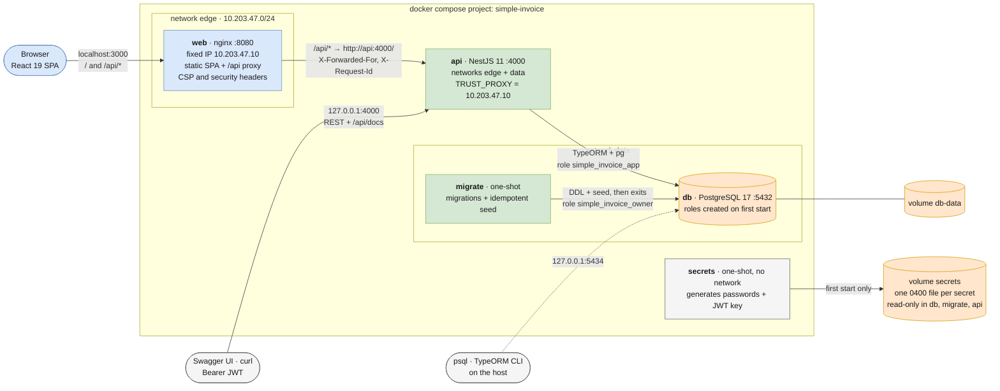

# SimpleInvoice

SimpleInvoice is a submission for the 101 Digital full-stack assessment. It has three parts: a **React 19 +
TypeScript** single-page app, a **NestJS 11** REST API and a **PostgreSQL 17** database. One Docker Compose
command starts all three from a fresh clone. You sign in, then search, filter, sort and page through invoices, open
one, or create a new one. The server always computes invoice totals and the _Overdue_ status.

| | |
| --- | --- |
| Start | `docker compose up --build`, then open <http://localhost:3000> |
| Sign in | `reviewer@simpleinvoice.dev` / `Reviewer@2026` |
| API docs | <http://localhost:4000/api/docs> (Swagger UI) |

## Features against the brief

| Brief | Requirement | Where it is met |
| --- | --- | --- |
| 2.1.1 | Login, client- and server-side validation | zod form schema; `LoginDto` with class-validator |
| 2.1.1 | JWT stored securely on the client | HttpOnly, SameSite=Strict cookie; also returned in the body for Bearer clients |
| 2.1.1 | Protected routes redirect to login | `SessionGuard` on the web; global `JwtAuthGuard` on the API |
| 2.1.2 | Invoice list, search, status filter, sort, server-side paging | `GET /invoices`; list state kept in the URL |
| 2.1.3 | Invoice detail with totals, balance and status | `InvoiceDetailScreen` |
| 2.1.4 | Create form, one line item, Draft, unique number, toast + redirect | `CreateInvoiceDto` plus a mirrored zod schema |
| 2.3.1 | `/auth/login`, `/auth/me`, `GET/POST /invoices`, `GET /invoices/:id` | all present, plus logout, `/currencies`, `/health` |
| 2.3.2 | Server-side totals, unique numbers, due date ≥ invoice date, Overdue derived | decimal.js; unique index; DTO rule + DB `CHECK`; derived at read time |
| 2.3.3 | JWT guard, expiry from env, seeded reviewer | global guard, `JWT_EXPIRES_IN` (3600 s) |
| 2.3.4 | Seed via `npm run seed` | Appendix A + 40 generated invoices; idempotent |
| 2.3.5–2.3.6 | ValidationPipe, global exception filter | whitelist + `forbidNonWhitelisted`; one error shape |
| 2.3.7 | Unit tests + a workflow test | Jest, Supertest on real PostgreSQL, Playwright ([Testing](#testing)) |
| 2.3.8 | Swagger at `/api/docs` | `@nestjs/swagger` with Bearer and cookie schemes |
| 2.4.1 | Monorepo or two repos, documented | monorepo ([Architecture](#architecture)) |
| 2.4.2 | One compose command, a Dockerfile per app, ports documented | [Quick start](#quick-start-docker), [URLs and ports](#urls-and-ports) |
| 2.4.3 | `.env` configuration, `.env.example`, no hard-coded secrets | secrets generated on first start; `.env` optional |
| 3.2 | Document how the customer is stored | embedded snapshot ([Design decisions](#design-decisions-and-assumptions)) |

**Beyond the brief:**

- **Hardening:** a CSRF header rule and server-side logout revocation, login limits per IP and per account, a
  read/insert-only database role for the API, and a strict CSP. Containers run non-root and read-only on two
  networks, and each gets only its own secret files. See [Security](#security).
- **List extras:** an invoice-date range filter, a debounced search, shareable URLs and accessible responsive layouts.
- **Traceability:** an `X-Request-Id` on every response, which also appears in the logs, the error bodies and the UI
  error screens.
- **CI:** lint, typecheck, unit tests, API e2e on PostgreSQL, and Playwright with axe checks on the full compose
  stack. Dependabot keeps dependencies, base images and actions up to date.

## Architecture

The browser talks to one origin. nginx (`web`) serves the SPA and proxies `/api/*` to the API, so the auth cookie is
first-party and no CORS is needed. The API is a layered NestJS application: each feature module is split into
`presentation → application → domain`, and `infrastructure` adapters implement the application's ports.

Before the API starts, two one-shot services run:

- `secrets` generates the passwords and the JWT key on the first start.
- `migrate` applies the migrations and the seed as the schema owner, then exits.

The API itself connects as a role that may only read and insert rows.



The services start in this order: `secrets` → `db` healthy → `migrate` exits 0 → `api` healthy → `web`.
[docs/ARCHITECTURE.md](docs/ARCHITECTURE.md) has the other diagrams (backend pipeline, frontend, auth, list and
create flows, ERD, security layers), the tech stack and the repository layout.

**Why a monorepo.** The brief allows either option. With one repository, a reviewer needs one clone and one command,
and the API contract, the API and the SPA change in the same commit and CI run. The apps stay independent: each has
its own `package.json`, lockfile and Dockerfile, with no npm workspaces, so either could move to its own repository
later. `apps/web` is the brief's `frontend/`, and `apps/api` is its `backend/`.

## Quick start (Docker)

Prerequisites:

- Docker with Compose v2 (Docker Desktop, Colima or OrbStack)
- free host ports 3000, 4000 and 5434; you can change them with `WEB_PORT`, `API_PORT` and `DB_HOST_PORT` in `.env`

```bash
git clone https://github.com/evilcatkimi/simpleinvoice-fullstack.git simple-invoice
cd simple-invoice
docker compose up --build        # or: make up
```

No `.env` and no setup step are needed. On the first start, the `secrets` service generates the database passwords
and the JWT key into the `secrets` volume, `db` creates the database and its roles, and `migrate` applies the schema
and seeds the data. The first build takes a few minutes. After that, the stack is healthy in about 30 seconds.

A `.env` file is optional. Any value in it overrides the compose default or the generated secret; see
[docs/CONFIGURATION.md](docs/CONFIGURATION.md). To stop the stack, run `make down`, which keeps the data. `make reset`
(`docker compose down -v`) deletes the data and the secrets together, so the next start begins from zero. On Windows,
run the commands from WSL2 or Git Bash.

## URLs and ports

| What | Address | Bound to |
| --- | --- | --- |
| Web app (SPA + `/api/*` proxy) | <http://localhost:3000> | all interfaces |
| REST API | <http://localhost:4000> | 127.0.0.1 only |
| Swagger UI | <http://localhost:4000/api/docs> (JSON: `/api/docs-json`) | 127.0.0.1 only |
| PostgreSQL | `127.0.0.1:5434` | 127.0.0.1 only |
| Vite dev server (without Docker) | <http://localhost:5173> | localhost |

Container ports, networks and health checks are in [docs/CONFIGURATION.md](docs/CONFIGURATION.md#4-ports-and-networks).

## Default credentials

| E-mail | Password |
| --- | --- |
| `reviewer@simpleinvoice.dev` | `Reviewer@2026` |

The seed creates this account from `SEED_ADMIN_EMAIL` / `SEED_ADMIN_PASSWORD`.

- **This is a published demo password.** Compose and `.env.example` default to it, together with
  `SEED_ALLOW_DEMO_PASSWORD=true`, for the review stack only. For any shared environment, set a unique
  `SEED_ADMIN_PASSWORD` and `SEED_ALLOW_DEMO_PASSWORD=false`.
- **In Swagger UI:** call `POST /auth/login`, copy `accessToken`, click **Authorize** and paste the token.

## Running without Docker

You need Node.js 24+ and PostgreSQL 17. The simplest setup runs only the database in Docker:

```bash
./scripts/init-env.sh              # .env with DB_HOST=localhost, DB_PORT=5434 and random secrets
docker compose up -d db            # PostgreSQL on 127.0.0.1:5434; roles use the passwords from .env

cd apps/api && npm ci
npm run migration:run && npm run seed
npm run start:dev                  # http://localhost:4000

cd apps/web && npm ci && npm run dev   # second terminal: http://localhost:5173, proxies /api to :4000
```

The local API must know the passwords that the database was initialised with. Create `.env` **before** the first
`docker compose up`. If the database already exists, run `make reset` first (this **deletes all data**).
[docs/CONFIGURATION.md](docs/CONFIGURATION.md#6-running-without-docker) covers your own PostgreSQL server and
production mode.

## Seed data

```bash
cd apps/api && npm run seed          # on the host
docker compose run --rm migrate      # in Docker: migrations (no-op when current) + seed
```

In Docker, the seed runs in the `migrate` service on every `docker compose up`, before the API starts. It creates
the reviewer account, the Appendix A invoice (stored as _Pending_, because _Overdue_ is derived) and 40 reproducible
generated invoices (`INV-2026-0001` … `0040`) that cover every status filter. The seed is idempotent. It runs in one transaction with `ON CONFLICT DO NOTHING`, so running it again never
duplicates data. Generated dates are relative to the day of the first seed, and `make reset && make up` refreshes
them. [docs/API_CONTRACT.md §8](docs/API_CONTRACT.md#8-seed-npm-run-seed-idempotent) has the details.

## Testing

| Suite | Command | Needs |
| --- | --- | --- |
| API unit (549 tests) | `cd apps/api && npm test` | Node.js 24 |
| API e2e (107 tests, real PostgreSQL) | `cd apps/api && npm run test:e2e` | `docker compose up -d db`, `psql`, a root `.env` |
| Web (284 tests) | `cd apps/web && npm test` | Node.js 24 |
| Full stack, Playwright (44 tests) | `make test-e2e` | Docker, Node.js 24 |
| Lint, format, typecheck | `make lint` | Node.js 24 |

The API e2e suite creates its own database and roles for each run, so it never touches your data. For the brief's
mandatory test topics (2.3.7):

| Topic | Tests |
| --- | --- |
| Invoice totals | `invoice-calculator.spec.ts`, `money.spec.ts`, e2e workflow (100.05 × 10 % → 10.01) |
| Overdue derivation | `invoice-status.spec.ts`, `invoice-list.query.spec.ts`, e2e status filters |
| Due-date rule | `date.validators.spec.ts`, `create-invoice.dto.spec.ts`, e2e 400 |
| Unique numbers | `typeorm-invoice.repository.spec.ts`, `postgres-errors.spec.ts`, e2e 409 |
| Full workflow | `invoices.e2e-spec.ts` (create → list → detail), Playwright |

More detail: [apps/api/README.md](apps/api/README.md#tests), [apps/web/README.md](apps/web/README.md#tests),
[tests/e2e/README.md](tests/e2e/README.md).

## Continuous integration

GitHub Actions runs lint, format check, typecheck, tests and `npm audit` for both apps, plus the API e2e suite
against PostgreSQL. It then runs a bare `docker compose up` with no `.env` and runs Playwright against that stack,
which proves the fresh-clone path. [docs/ARCHITECTURE.md](docs/ARCHITECTURE.md#11-continuous-integration) has the job
list.

## Security

- **Session:** the JWT lives in an HttpOnly, SameSite=Strict cookie. The cookie is named `__Host-` with
  `COOKIE_SECURE=true`. The SPA never reads the token.
- **CSRF and input:** cookie-authenticated unsafe requests and logout need `X-Requested-With`. Bodies are JSON only,
  up to 100 kB and 8 levels deep.
- **Tokens:** a global guard checks every route. Tokens are HS256 with the algorithm pinned. Logout revokes the
  token's `jti`.
- **Login limits:** 5 attempts per minute per IP and 10 failures per 15 minutes per account. The client IP comes only
  from nginx's fixed address.
- **Database:** the API role has `SELECT` and `INSERT` only. Migrations and the seed run as a separate owner in
  `migrate`.
- **Secrets:** they are generated on the first start. Each one is readable only by the container user that needs it,
  so the API cannot read the owner or superuser passwords. They never appear in the image or the repository.
- **Containers and network:** containers run non-root and read-only, with capabilities dropped and digest-pinned
  images. The API and PostgreSQL listen on 127.0.0.1 only.

The threat model, all findings (SEC-01 … SEC-27) and the Docker runtime checks are in
[docs/SECURITY.md](docs/SECURITY.md).

## Design decisions and assumptions

- **Customer (brief 3.2):** embedded in `invoices` as snapshot columns (`customer_fullname`, `customer_email`, …), so
  an issued invoice keeps the customer as they were. Search stays a single-table query; a `customers` table can come
  later.
- **Overdue:** derived at read time as `status != Paid AND dueDate < today`; the enum cannot store it. _Today_ is the
  date in `APP_TIMEZONE` (default UTC) from an injected `Clock`, and an invoice due today is not overdue yet.
- **Status filters** agree with the badge: `Overdue` = not Paid and past due; `Draft` / `Pending` = that status and
  not past due.
- **Money:** `numeric(14,2)` in PostgreSQL and decimal.js (half-up) in the API, never binary floating point. More
  than 2 decimals, or a total that does not fit, gets a 400.
- **Tax** is a percentage (0–100, default 10) applied to the subtotal and rounded once. **Discount** is an absolute
  amount (default 0, at most subtotal + tax), as Appendix A shows (20 on 2000 + 200).
- **Payments** are outside the brief: new invoices have `totalPaid = 0`; seeded ones carry payments to show balances.
- **Line items:** the API accepts exactly one, as the brief asks; the schema and the calculator support many.
- **Currency:** one of 8 ISO 4217 codes; the server derives `currencySymbol`.
- **Invoice numbers:** user-provided, at most 50 characters. A unique index on `upper(invoice_number)` decides
  duplicates (409), so `INV-001` and `inv-001` clash, and there is no check-then-insert race.
- **Dates** are `YYYY-MM-DD` strings end to end, so they never shift with a time zone.
- **Session:** the JWT is in an HttpOnly cookie for the SPA and in the body for Bearer clients (Swagger, curl).
  Access tokens only (1 h by default), revoked on logout; no refresh token.
- **CSRF:** SameSite=Strict, the `X-Requested-With` rule and JSON-only bodies, three independent layers.
- **Client IP:** `TRUST_PROXY` is nginx's fixed address, not a hop count, which would let a direct caller pick its
  own rate-limit bucket.
- **Secure by default:** the JWT guard is global; public routes opt out with `@Public()`.
- **Single tenant:** every signed-in user sees all invoices, as the brief describes; `createdBy` records the author.
- **Validation:** the API is authoritative (unknown fields get a 400); the web app mirrors the rules with zod.
- **Response shapes:** `paging` adds `totalPages`; error bodies add `path`, `timestamp` and `requestId`.
- **List defaults:** `page=1`, `pageSize=10` (maximum 100), `sortBy=invoiceDate`, `ordering=DESC`, with stable
  tie-breakers.
- **Routes:** at the root, as the brief lists them; nginx and Vite serve them under `/api` on the SPA's origin.
- **Schema:** one hand-written SQL migration (`InitSchema`), no `synchronize`, applied by `migrate` before the API
  starts.
- **Database roles:** the bootstrap superuser only initialises the volume; `simple_invoice_owner` owns the schema;
  `simple_invoice_app` (the API) may only `SELECT` and `INSERT`.
- **Zero-setup Docker:** compose generates the secrets instead of shipping defaults (brief 2.4.3), and services still
  receive them as environment variables. The only built-in credential is the documented reviewer login.
- **Appendix A** is stored verbatim with the status _Pending_. `type` and `invoiceGrossTotal` are not modelled, and
  the timestamp without an offset is read as UTC.
- **Login e-mails** are case-insensitive (unique on `lower(email)`). The UI formats with a fixed `en-GB` locale.

## Known limitations

- **No editing:** there are no update, delete, status-change or payment endpoints. Pending and Paid invoices come only
  from the seed.
- **One line item** per invoice in the API and the form.
- **No refresh tokens:** the user signs in again after the token expires (1 h by default).
- **In-memory state:** rate limits, lockouts and revoked tokens are per API instance and reset on restart. Several
  replicas would need Redis behind the same ports.
- **Account lockout:** anyone can lock an account for 15 minutes with 10 failed logins.
- **No TLS in compose:** put HTTPS in front and set `COOKIE_SECURE=true`.
- **Single tenant, single role:** there is no registration or user management.
- **Currencies:** mixed currencies are not converted, so sorting by total compares raw amounts.
- **Search** is a plain substring match. It is not accent-insensitive (`Garcia` does not find `García`), and there is
  no ranking.
- **Seed dates** stay fixed after the first run. `make reset` refreshes them.
- **Currency list:** the web app keeps a fallback copy of it, which must stay in sync with the API.
- **Locale:** a fixed `en-GB` format and an English-only UI.
- **Expired session:** a session that expires while the create form is open discards the input.
- **`schema_migrations`:** the API role can insert into this table. Production should revoke that
  ([SECURITY.md §5](docs/SECURITY.md#5-accepted-risks)).

## Further documentation

| Document | Contents |
| --- | --- |
| [docs/ARCHITECTURE.md](docs/ARCHITECTURE.md) | diagrams, request pipeline, ERD, tech stack, repository layout, CI |
| [docs/API_CONTRACT.md](docs/API_CONTRACT.md) | endpoints, shapes, validation rules, schema, seed, curl examples |
| [docs/CONFIGURATION.md](docs/CONFIGURATION.md) | environment variables, secrets, ports and networks, make targets, troubleshooting |
| [docs/SECURITY.md](docs/SECURITY.md) | threat model, controls, review findings, runtime checks |
| [apps/api/README.md](apps/api/README.md) | API scripts, structure, conventions |
| [apps/web/README.md](apps/web/README.md) | SPA scripts, structure, tests |
| [tests/e2e/README.md](tests/e2e/README.md) | Playwright suite |
