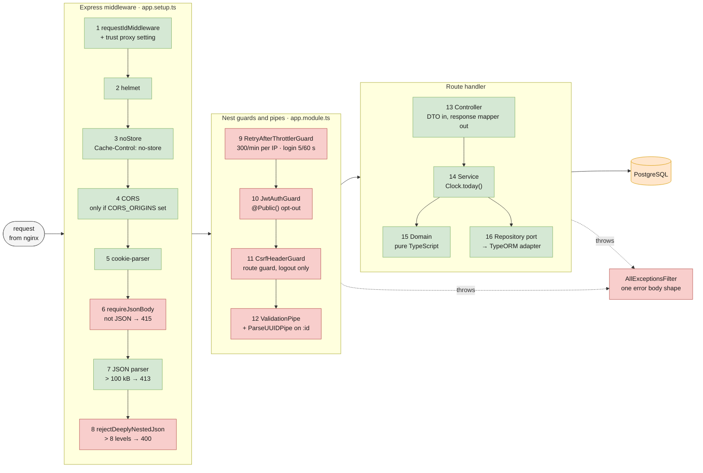
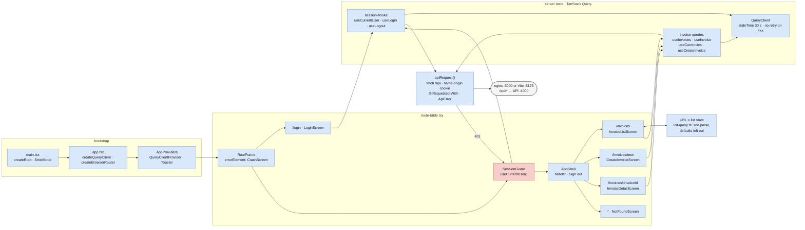
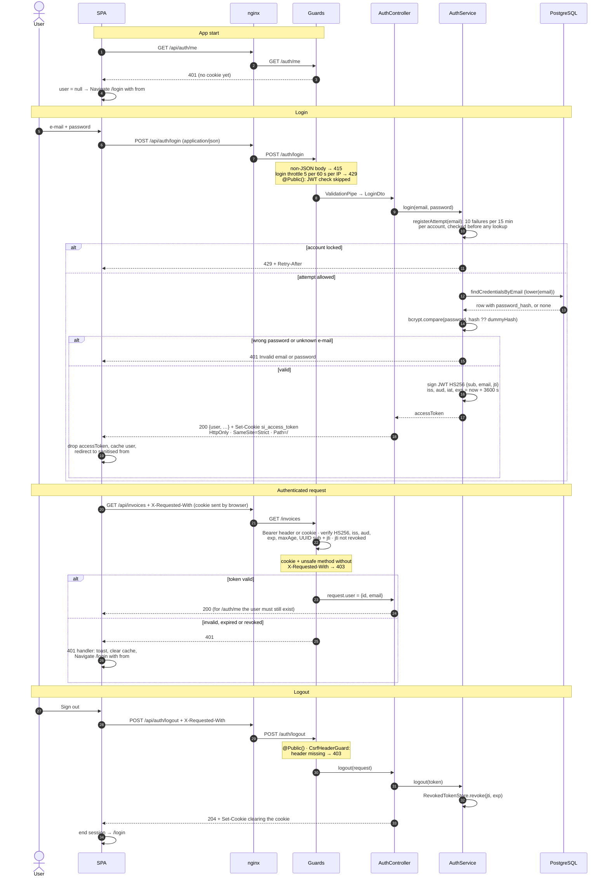
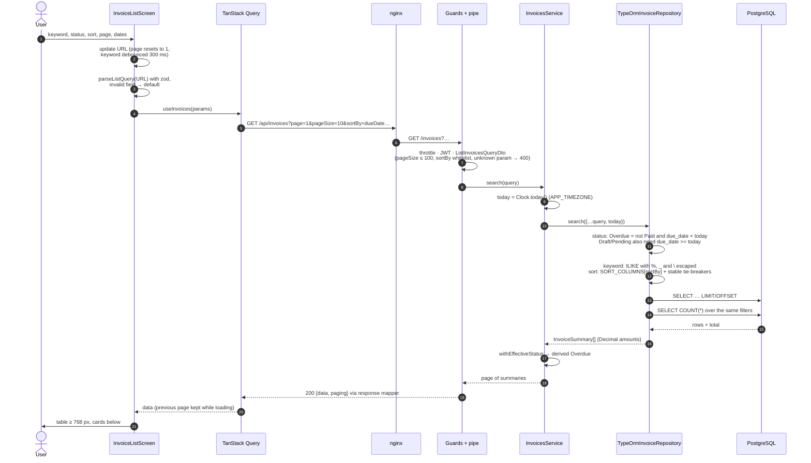
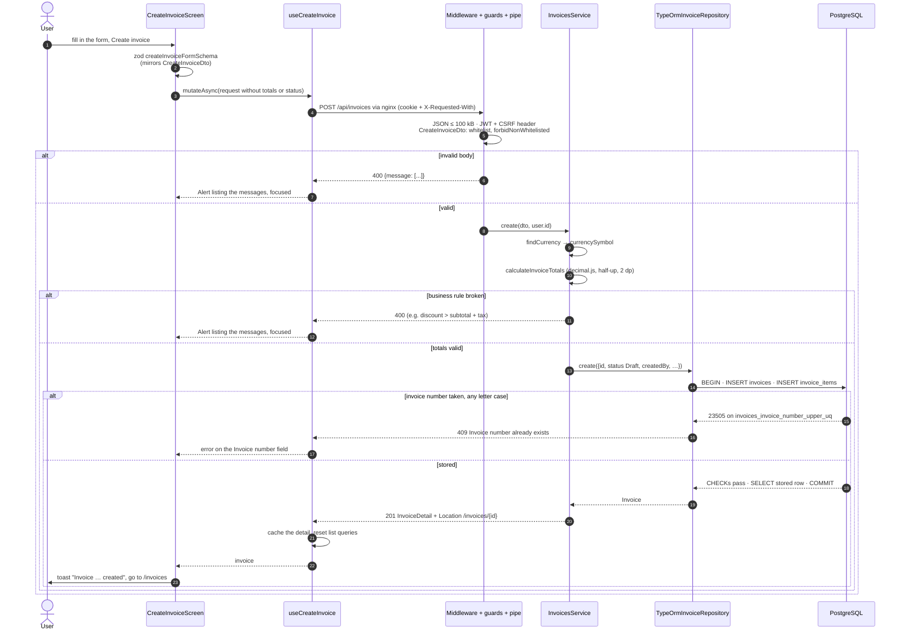
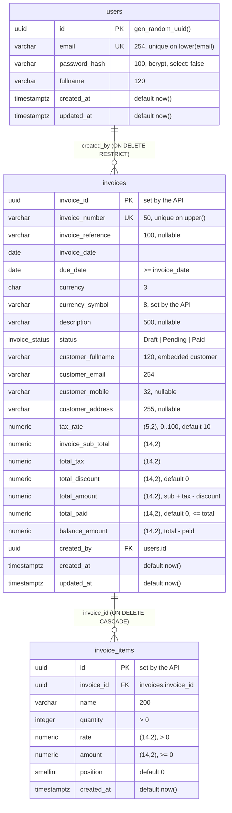

# SimpleInvoice — Architecture

How the stack fits together, in diagrams. The system overview (containers, networks, ports) is in the
[root README](../README.md#architecture). The request and response shapes are in [API_CONTRACT.md](API_CONTRACT.md).
The threat model and the review findings (the `SEC-nn` ids) are in [SECURITY.md](SECURITY.md).

The diagrams are [Mermaid](https://mermaid.js.org). GitHub, GitLab and the VS Code Markdown preview render them in
place. The colours mean the same thing in every diagram:

- **blue**: the browser and nginx
- **green**: the API
- **orange**: PostgreSQL
- **red**: a security control
- **grey**: tooling and operations

## Contents

1. [Request path](#1-request-path)
2. [Backend layers and request pipeline](#2-backend-layers-and-request-pipeline)
3. [Frontend structure](#3-frontend-structure)
4. [Auth flow](#4-auth-flow)
5. [Invoice list flow](#5-invoice-list-flow)
6. [Create invoice flow](#6-create-invoice-flow)
7. [Database ERD](#7-database-erd)
8. [Security layers](#8-security-layers)
9. [Tech stack](#9-tech-stack)
10. [Repository layout](#10-repository-layout)
11. [Continuous integration](#11-continuous-integration)

## 1. Request path

The browser only ever talks to **one origin**. The `web` container (nginx) serves the built SPA and reverse-proxies
`/api/*` to the `api` container, stripping the `/api` prefix. The auth cookie is therefore first-party, and the SPA
never needs CORS (the API leaves it off by default).

Compose puts the containers on two networks: `edge` (web, api) and `data` (migrate, api, db), so nginx cannot reach
PostgreSQL. nginx has a fixed address on `edge` (`10.203.47.10`), the only peer whose `X-Forwarded-For` the API
trusts.

The services start in this order: `secrets` exits 0 → `db` healthy → `migrate` exits 0 → `api` healthy → `web`.

- `secrets` generates the database passwords and the JWT key into the `secrets` volume on the first start.
- `migrate` applies the migrations and the seed as the schema owner `simple_invoice_owner`, then exits.
- `api` connects as `simple_invoice_app`, a role that may only read and insert rows.

**One request, end to end** (`GET /invoices`):

1. The browser calls `GET /api/invoices?…` on its own origin. It attaches the HttpOnly cookie automatically.
2. nginx forwards the call to `http://api:4000/invoices?…` over a kept-alive upstream connection. It adds
   `X-Forwarded-For` and `X-Request-Id`.
3. The Express middleware runs in this order:
   1. request id
   2. helmet
   3. `Cache-Control: no-store`
   4. CORS, only when `CORS_ORIGINS` lists an origin
   5. cookie-parser
   6. JSON-only check (415)
   7. JSON body parser: 100 kB at most (413)
   8. nesting depth check: 8 levels at most (400)
4. The global guards run. First the throttler guard, keyed on the client IP. The API takes that IP from
   `X-Forwarded-For` only because the TCP peer is nginx. Then `JwtAuthGuard` checks the JWT and that its `jti` was
   not revoked by a logout. For cookie-authenticated unsafe methods, it also checks the CSRF header.
5. The global `ValidationPipe` turns the query string into a validated `ListInvoicesQueryDto`.
6. The request passes through `InvoicesController`, then `InvoicesService`, which takes _today_ from the injected
   `Clock`. It then reaches the `InvoiceRepository` port, whose TypeORM adapter builds parameterised SQL.
7. The rows are mapped to domain objects and the _Overdue_ status is derived. The response is serialised as
   `{ data, paging }`. Any error goes through `AllExceptionsFilter`.

## 2. Backend layers and request pipeline

Every request passes the same chain. It starts with `configureApp()` in `app.setup.ts` (shared by `main.ts` and the
e2e tests), then runs the global guards and pipes registered in `app.module.ts`:



Each feature module (`auth`, `users`, `invoices`, `currencies`, `health`) has the same four layers. Services depend
only on ports (abstract classes used as DI tokens), and Nest binds each port to an infrastructure adapter. As a
result, services never import TypeORM, bcrypt or the JWT library:

```mermaid
flowchart TB
    subgraph presentation["presentation · controllers, DTOs, response mappers"]
        direction LR
        authCtl["AuthController<br/>/auth/login · /me · /logout"]
        invCtl["InvoicesController<br/>GET, GET :id, POST /invoices"]
        curCtl["CurrenciesController<br/>GET /currencies"]
        healthCtl["HealthController<br/>GET /health"]
    end

    subgraph application["application · use cases"]
        direction LR
        authSvc["AuthService<br/>login · logout · getProfile"]
        invSvc["InvoicesService<br/>search · getById · create"]
    end

    subgraph ports["application ports · abstract classes used as DI tokens"]
        direction LR
        pHash["PasswordHasher"]
        pIssuer["AccessTokenIssuer"]
        pLimiter["LoginAttemptLimiter"]
        pRevoked["RevokedTokenStore"]
        pUsers["UserRepository"]
        pInvoices["InvoiceRepository"]
        pClock["Clock (shared)"]
    end

    subgraph domain["domain · pure TypeScript"]
        direction LR
        userDomain["User<br/>UserCredentials"]
        invDomain["invoice-calculator<br/>deriveInvoiceStatus · Money"]
        curDomain["SUPPORTED_CURRENCIES"]
    end

    subgraph infrastructure["infrastructure · adapters, which import the ports"]
        direction LR
        aBcrypt["BcryptPasswordHasher"]
        aJwt["JwtAccessTokenIssuer"]
        aLimiter["InMemoryLoginAttemptLimiter"]
        aRevoked["InMemoryRevokedTokenStore"]
        aUsers["TypeOrmUserRepository"]
        aInvoices["TypeOrmInvoiceRepository<br/>invoice-list.query"]
        aClock["SystemClock"]
        aGuard["JwtAuthGuard · CsrfHeaderGuard<br/>AccessTokenVerifier"]
        aHealth["DatabaseHealthIndicator"]
    end

    authCtl --> authSvc
    invCtl --> invSvc
    curCtl --> curDomain
    healthCtl --> aHealth
    authSvc --> pHash & pIssuer & pLimiter & pRevoked & pUsers
    invSvc --> pInvoices & pClock
    authSvc --> userDomain
    invSvc --> invDomain & curDomain

    pHash -. "bound to" .-> aBcrypt
    pIssuer -. "bound to" .-> aJwt
    pLimiter -. "bound to" .-> aLimiter
    pRevoked -. "bound to" .-> aRevoked
    pUsers -. "bound to" .-> aUsers
    pInvoices -. "bound to" .-> aInvoices
    pClock -. "bound to" .-> aClock

    classDef be fill:#d5e8d4,stroke:#82b366,color:#1a1a1a
    classDef port fill:#ffffff,stroke:#82b366,color:#1a1a1a,stroke-dasharray:4 3
    classDef sec fill:#f8cecc,stroke:#b85450,color:#1a1a1a
    classDef data fill:#ffe6cc,stroke:#d79b00,color:#1a1a1a
    class authCtl,invCtl,curCtl,healthCtl,authSvc,invSvc,userDomain,invDomain,curDomain,aClock be
    class pHash,pIssuer,pLimiter,pRevoked,pUsers,pInvoices,pClock port
    class aBcrypt,aJwt,aLimiter,aRevoked,aGuard sec
    class aUsers,aInvoices,aHealth data
```



Redis-backed adapters could replace the in-memory login limiter and revoked-token store to run several API
instances. The e2e tests replace `SystemClock` with a fixed clock.

## 3. Frontend structure



`SessionGuard` is a layout route. While `/auth/me` is pending, it shows a spinner. It sends an anonymous user to
`/login`, with the current location as `from`, and it registers the 401 handler that ends the session. The invoice
list keeps all its filters in the URL, so refresh, back/forward and shared links show the same view.

## 4. Auth flow



- Login accepts JSON only, so a cross-site HTML form cannot sign a victim in.
- The per-account limit runs before any lookup or bcrypt.
- Unknown e-mails are compared against a dummy hash, so the response time does not reveal whether an account
  exists.
- API clients (Swagger, curl) send `Authorization: Bearer <token>` instead of the cookie.
- There is no refresh token: after `exp`, the user signs in again.

## 5. Invoice list flow



- One `today` feeds both the SQL filter and the displayed status, so a row never shows _Overdue_ under a _Pending_
  filter.
- Every value is a bound parameter, and the sort column comes from a whitelist map.
- The total is a plain `COUNT(*)` over the same filters.
- Trigram GIN indexes serve `ILIKE '%keyword%'`.

## 6. Create invoice flow



- The client never sends totals, status, `currencySymbol` or `createdBy`. If it does, the DTO rejects them.
- The unique index on `upper(invoice_number)` decides duplicates. There is no SELECT before the INSERT, so two
  concurrent requests cannot both win.
- CHECK constraints refuse totals that do not add up.

## 7. Database ERD



In the comments, a single number is the `varchar` / `char` length, and `(p,s)` is `numeric(precision, scale)`. One
migration creates the whole schema:
[`1790640000000-InitSchema.ts`](../apps/api/src/infrastructure/database/migrations/1790640000000-InitSchema.ts).
The object names below come from it.

| Object | Definition |
| --- | --- |
| CHECKs on `invoices` | `invoices_due_date_check`: due date ≥ invoice date |
| | `invoices_tax_rate_check`: tax rate 0–100 |
| | `invoices_amounts_non_negative_check` |
| | `invoices_total_paid_check`: paid ≤ total |
| | `invoices_balance_check`: balance = total − paid |
| | `invoices_total_check`: total = sub-total + tax − discount |
| CHECKs on `invoice_items` | `quantity > 0` · `rate > 0` · `amount >= 0` |
| Foreign keys | `invoices_created_by_fk` → `users(id)`, ON DELETE RESTRICT |
| | `invoice_items.invoice_id` → `invoices(invoice_id)`, ON DELETE CASCADE |
| Unique indexes | `users_email_lower_uq` on `lower(email)` |
| | `invoices_invoice_number_upper_uq` on `upper(invoice_number)` |
| Sort indexes | `invoices_invoice_date_idx` · `invoices_due_date_idx` · `invoices_total_amount_idx` |
| Other indexes | `invoices_status_due_date_idx` (status filters, including Overdue) · `invoices_created_by_idx` · `invoice_items_invoice_id_idx` |
| Trigram GIN indexes | `invoices_invoice_number_trgm_idx` · `invoices_customer_fullname_trgm_idx` (`pg_trgm`) |
| Types | `invoice_status` ENUM (`Draft`, `Pending`, `Paid`): _Overdue_ is derived and cannot be stored |
| Roles | `simple_invoice_owner`: owns the database and schema, runs migrations and the seed |
| | `simple_invoice_app`: the API; CONNECT, USAGE, SELECT and INSERT only |

Neither role is a superuser. Both are created by
[`infra/postgres/initdb/01-app-roles.sh`](../infra/postgres/initdb/01-app-roles.sh).

The customer is a snapshot embedded in `invoices`, with no customers table, so later changes never rewrite an issued
invoice. Money is exact `numeric`, read into decimal.js values. Dates travel as `YYYY-MM-DD` strings.

## 8. Security layers

```mermaid
flowchart TB
    subgraph L1["1 · Browser and SPA"]
        direction LR
        b1["JWT only in an HttpOnly cookie<br/>never in JS storage"]
        b2["X-Requested-With on every call<br/>SEC-06"]
        b3["same-origin 'from' redirect"]
        b4["React escaping · encoded mailto<br/>SEC-19"]
    end
    subgraph L2["2 · Edge: nginx"]
        direction LR
        n1["CSP script-src 'self',<br/>X-Frame-Options DENY, nosniff"]
        n2["fixed IP 10.203.47.10,<br/>only trusted proxy · SEC-01"]
        n3["body ≤ 100k · proxy timeouts"]
        n4["/api/api/ → 404<br/>SEC-20"]
    end
    subgraph L3["3 · API HTTP layer"]
        direction LR
        h1["JSON only · ≤ 100 kB · depth 8<br/>SEC-04, SEC-06"]
        h2["Cache-Control: no-store<br/>SEC-07"]
        h3["no CORS by default<br/>SEC-11"]
        h4["300 req/min per IP, login 5/60 s<br/>SEC-01, SEC-15"]
    end
    subgraph L4["4 · Authentication and session"]
        direction LR
        a1["global JwtAuthGuard · HS256 pinned<br/>exp, iat, maxAge, jti · SEC-12"]
        a2["JWT_SECRET strength check<br/>SEC-14"]
        a3["bcrypt + dummy hash ·<br/>lockout 10 per 15 min · SEC-18"]
        a4["__Host- cookie, SameSite=Strict<br/>SEC-08"]
        a5["logout revokes jti<br/>SEC-09"]
    end
    subgraph L5["5 · Validation and business logic"]
        direction LR
        v1["whitelist + forbidNonWhitelisted<br/>strict DTOs"]
        v2["server-side totals ·<br/>createdBy from the JWT"]
        v3["bound parameters · sort whitelist<br/>LIKE escaping"]
        v4["safe errors · no PII in logs<br/>SEC-05"]
    end
    subgraph L6["6 · PostgreSQL"]
        direction LR
        d1["owner vs app role,<br/>no superuser · SEC-03"]
        d2["unique upper(invoice_number)<br/>SEC-16 · CHECKs, FKs"]
        d3["data network,<br/>127.0.0.1 only · SEC-10"]
    end
    subgraph L7["7 · Operations and supply chain"]
        direction LR
        o1["generated secrets, 0400 per service<br/>SEC-13, SEC-27 · demo password SEC-02, SEC-24"]
        o2["non-root, read-only FS,<br/>cap_drop ALL · SEC-10"]
        o3["digest-pinned images,<br/>SHA-pinned actions · SEC-21"]
        o4["Swagger off in production<br/>SEC-15 · no telemetry SEC-17"]
    end

    L1 --> L2 --> L3 --> L4 --> L5 --> L6
    L6 -.- L7

    classDef fe fill:#dae8fc,stroke:#6c8ebf,color:#1a1a1a
    classDef be fill:#d5e8d4,stroke:#82b366,color:#1a1a1a
    classDef sec fill:#f8cecc,stroke:#b85450,color:#1a1a1a
    classDef data fill:#ffe6cc,stroke:#d79b00,color:#1a1a1a
    classDef ops fill:#f5f5f5,stroke:#666666,color:#1a1a1a
    class b1,b2,b3,b4,n1,n2,n3,n4 fe
    class h1,h2,h3,h4,v1,v2,v3,v4 be
    class a1,a2,a3,a4,a5 sec
    class d1,d2,d3 data
    class o1,o2,o3,o4 ops
```



Each band is one layer of the request path, and each assumes that the one above it can fail. The SPA validates for
usability, the API validates again, and the database constraints still hold if a bug or a manual SQL fix slips
through. The accepted risks (no refresh token, per-instance in-memory limits, no TLS inside compose) are in
[SECURITY.md](SECURITY.md#5-accepted-risks).

## 9. Tech stack

| Area | Choice | Why |
| --- | --- | --- |
| Frontend | React 19, TypeScript strict, Vite 8 | required by the brief; the Vite dev server has the same `/api` proxy as nginx |
| Routing | React Router 8 (data router) | nested layout routes put every protected screen behind one `SessionGuard` |
| Server state | TanStack Query 5 | caching, cancellation, previous page kept while paging |
| Forms | react-hook-form + zod 4 | the zod schema mirrors the API DTO |
| Styling | Tailwind CSS v4, lucide-react, sonner | build-time CSS, no inline scripts, so the CSP stays strict |
| Backend | NestJS 11 on Express 5, TypeScript strict | modules and DI make the layering explicit and testable |
| Persistence | TypeORM 0.3 + `pg`, hand-written SQL migrations | explicit constraints and indexes; no `synchronize` |
| Database | PostgreSQL 17 | exact `numeric`, `CHECK` constraints, `pg_trgm` |
| Money | decimal.js | exact decimal arithmetic, half-up rounding |
| Auth | @nestjs/jwt (HS256), bcrypt, cookie-parser | JWT as the brief asks, plus revocation on logout |
| Validation | class-validator + class-transformer | required by the brief (2.3.5) |
| Hardening | helmet, @nestjs/throttler, per-account login limit, nginx headers | defence in depth ([SECURITY.md](SECURITY.md)) |
| API docs | @nestjs/swagger | required by the brief (2.3.8) |
| Logging | nestjs-pino | structured logs with request ids and redaction |
| Tests | Jest 30 + Supertest, Vitest 5 + Testing Library + MSW, Playwright + axe-core | unit, real-database e2e, real-browser e2e |
| Delivery | multi-stage Dockerfiles (digest-pinned bases), docker compose, nginx-unprivileged, GitHub Actions, Dependabot | one command locally, the same stack in CI |

NestJS 11 rather than 12: version 12 is ESM-only, which conflicts with the CommonJS toolchain used here. That
toolchain is ts-jest, the TypeORM CLI via `typeorm-ts-node-commonjs`, and the ts-node seed script.

## 10. Repository layout

```
.
├── apps/
│   ├── api/                     NestJS API — own package.json, lockfile and Dockerfile
│   │   ├── src/
│   │   │   ├── config/                    environment schema + validation, .env loading
│   │   │   ├── shared/                    clock, dates, decorators, errors, exception filter, request id,
│   │   │   │                              logging, pagination, swagger, throttling, validation
│   │   │   ├── infrastructure/database/   TypeORM options, CLI data source, migrations/, seeds/
│   │   │   └── modules/<auth|users|invoices|currencies|health>/
│   │   │                                  {presentation, application, domain, infrastructure}
│   │   └── test/                          e2e specs (Supertest against a real PostgreSQL database)
│   └── web/                     React SPA — own package.json, lockfile, Dockerfile and nginx/ config
│       └── src/  bootstrap/ · shell/ · core/ · ui/ · session/ ·
│                 invoices/{model, data, list, detail, create, common} · test-support/
├── infra/postgres/              db image: pinned official base, role setup (initdb/), secret generation
│                                (generate-secrets.sh) and an entrypoint that loads the secrets
├── tests/e2e/                   Playwright full-stack tests (+ compose override for the test stack)
├── docs/                        ARCHITECTURE.md · API_CONTRACT.md · CONFIGURATION.md · SECURITY.md
├── scripts/init-env.sh          optional: writes .env with random secrets (running without Docker)
├── .github/                     CI workflow and Dependabot configuration
├── docker-compose.yml
├── Makefile
└── .env.example
```

The folder names follow the common `apps/*` convention: `apps/web` is the brief's `frontend/`, and `apps/api` is
its `backend/`. The README explains
[why this is a monorepo](../README.md#architecture).

## 11. Continuous integration

`.github/workflows/ci.yml` runs on pushes to `main` and on pull requests. The workflow token is read-only
(`permissions: contents: read`), and a newer run cancels an older one on the same ref.

| Job | Steps |
| --- | --- |
| `api` | `npm ci`, lint, format check, typecheck, unit tests (coverage thresholds), e2e tests against a `postgres:17-alpine` service, build, `npm audit --omit=dev --audit-level=high` |
| `web` | `npm ci`, lint, format check, typecheck, tests (coverage thresholds), build, `npm audit --omit=dev --audit-level=high` |
| `e2e` | Playwright suite checks, then a bare `docker compose … up -d --build --wait` with no `.env` and no setup step (the fresh-clone path), Playwright (Chromium), logs and report on failure, `docker compose down -v` |

Every action is pinned to a full commit SHA, with the version in a comment. `SCARF_ANALYTICS=false` opts the installs
out of a telemetry script that `@nestjs/swagger` pulls in. Dependabot (`.github/dependabot.yml`) opens weekly update
PRs for:

- both apps
- the e2e suite
- the Docker base images
- the GitHub Actions
